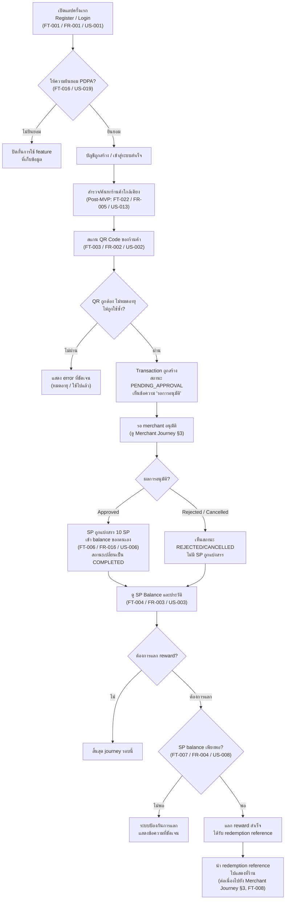
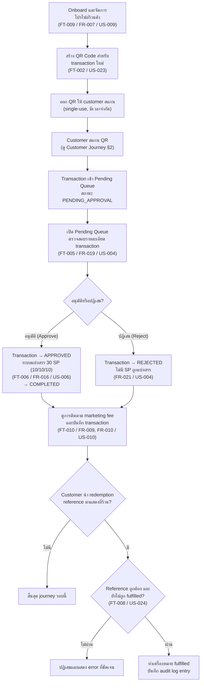
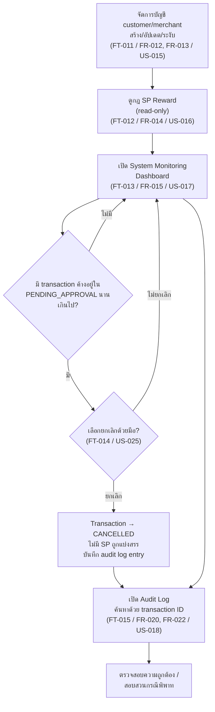

# ShopPlus Global - User Journey

**Version:** 1.0

**Last Updated:** 2026-08-17

**Document Owner:** User Journey Designer Agent (AI Native Development Workflow)

**Source:** `01-requirements/01-business-requirement.md` (v1.1), `01-requirements/02-product-backlog.md` (v1.1), `01-requirements/03-feature-list.md` (v1.0)

---

## Revision History (ประวัติการปรับปรุงเอกสาร)

| Version | Status | Change Summary |
|---|---|---|
| 1.0 | Draft — pending stakeholder review | สร้าง User Journey เริ่มต้นสำหรับ Customer, Merchant, และ Admin จาก BRD v1.1, Backlog v1.1, และ Feature List v1.0 |

---

## 1. Purpose (วัตถุประสงค์)

เอกสารนี้อธิบาย journey ของผู้ใช้แต่ละ actor หลัก (Customer, Merchant,
Admin) จาก**มุมมองผู้ใช้/หน้าจอ** — สิ่งที่ผู้ใช้เห็นและตัดสินใจในแต่ละ
ขั้นตอน — ซึ่งแตกต่างจาก
[`01-transaction-flow.md`](01-transaction-flow.md) ที่อธิบายมุมมอง
system/state machine ของ backend ทั้งสองเอกสารนี้ใช้คู่กัน: เอกสารนี้ตอบ
คำถาม "ผู้ใช้ทำอะไรและเห็นอะไร" ส่วน transaction flow ตอบคำถาม "ระบบ
ประมวลผลอย่างไร"

ทุกขั้นตอนใน diagram อ้างอิงกลับไปยัง Feature (`FT-xxx`),
Functional Requirement (`FR-xxx`), และ User Story (`US-xxx`) ที่เกี่ยวข้อง
เพื่อรักษา traceability ตลอดสาย BRD → Backlog → Feature List → User
Journey

---

## 2. Customer Journey

### Customer Journey — คำอธิบายตามลำดับขั้นตอน

1. **เปิดแอปครั้งแรกและลงทะเบียน/เข้าสู่ระบบ** — customer สร้างบัญชีหรือ
   login เข้าใช้งาน
2. **ให้ความยินยอมตาม PDPA** — ต้องยอมรับเงื่อนไขการเก็บข้อมูลก่อนใช้
   feature ที่เก็บข้อมูลได้ ถ้าไม่ยินยอม การเข้าถึงจะถูกปิดกั้น
3. **สำรวจ/ค้นหาร้านค้า** (Post-MVP) — customer ค้นหาร้านค้าที่เข้าร่วม
   โครงการใกล้เคียง (ยังไม่อยู่ใน MVP)
4. **สแกน QR Code ของร้านค้า** — ที่จุดชำระเงิน customer สแกน QR ที่
   merchant สร้างไว้
5. **ระบบตรวจสอบความถูกต้องของ QR** — ถ้าหมดอายุ/ถูกใช้ไปแล้ว/ไม่ถูก
   ต้อง จะถูกปฏิเสธพร้อม error ที่ชัดเจน
6. **Transaction ถูกสร้าง (`PENDING_APPROVAL`)** — customer เห็นการยืนยัน
   ว่ากำลังรอการอนุมัติจาก merchant
7. **รอผลการอนุมัติจาก merchant** — จุดเชื่อมกับ Merchant Journey (§3)
8. **ผลการอนุมัติ:**
   - ถ้า **Approved** → ระบบแบ่งสรร 10 SP ให้ customer และสถานะเปลี่ยน
     เป็น `COMPLETED`
   - ถ้า **Rejected/Cancelled** → customer เห็นสถานะนั้น ไม่มี SP ถูกแบ่ง
     สรร
9. **ดู SP Balance และประวัติ transaction** — customer ตรวจสอบผลลัพธ์
   ของตนเองได้เสมอ ไม่ว่าผลจะเป็นอย่างไร
10. **ตัดสินใจแลก reward หรือไม่** — ถ้าต้องการแลก ระบบตรวจสอบ balance
    ก่อนอนุญาต
11. **แลก reward สำเร็จ** — ได้รับ redemption reference เพื่อนำไปแสดงที่
    ร้าน ซึ่งต่อเนื่องไปยัง Merchant Journey (FT-008)

### Customer Journey — Requirement Mapping

| Step | Actor | Related FR | Related US | Related Feature |
|---|---|---|---|---|
| Register/Login | Customer | FR-001 | US-001 | FT-001 |
| PDPA Consent | Customer | — | US-019 | FT-016 |
| Shop Discovery (Post-MVP) | Customer | FR-005 | US-013 | FT-022 |
| Scan QR Code | Customer | FR-002 | US-002 | FT-003 |
| Wait for Approval | Customer/Merchant | FR-019, FR-021 | US-004, US-005 | FT-005 |
| SP Distributed (Approved) | Platform | FR-016, FR-017, FR-018 | US-006, US-007 | FT-006 |
| View Balance & History | Customer | FR-003 | US-003 | FT-004 |
| Redeem Reward | Customer | FR-004 | US-008 | FT-007 |
| Present Redemption at Shop | Customer/Merchant | — | US-024 | FT-008 |

---

## 3. Merchant Journey

### Merchant Journey — คำอธิบายตามลำดับขั้นตอน

1. **Onboard และจัดการโปรไฟล์ร้านค้า** — merchant กรอกข้อมูลร้าน (ชื่อ,
   ที่อยู่, ประเภท, เวลาเปิด-ปิด) ก่อนเริ่มรับ transaction ใด ๆ
2. **สร้าง QR Code สำหรับ transaction ใหม่** — merchant ขอ QR ที่ผูกกับ
   transaction identifier เฉพาะ ใช้ได้ครั้งเดียวและมีเวลาจำกัด
3. **ออก QR ให้ customer สแกน** — ที่จุดชำระเงิน
4. **Customer สแกน QR** — จุดเชื่อมกับ Customer Journey (§2)
5. **Transaction เข้า Pending Queue** — สถานะ `PENDING_APPROVAL` รอ
   merchant ตรวจสอบ
6. **เปิด Pending Queue และตรวจสอบรายละเอียด** — เห็นจำนวนเงิน ข้อมูล
   อ้างอิงลูกค้า และ timestamp
7. **ตัดสินใจอนุมัติหรือปฏิเสธ:**
   - **อนุมัติ** → transaction เปลี่ยนเป็น `APPROVED`, ระบบแบ่งสรร 30 SP
     (10/10/10) แล้วเปลี่ยนเป็น `COMPLETED`
   - **ปฏิเสธ** → transaction เปลี่ยนเป็น `REJECTED` ไม่มี SP ถูกแบ่งสรร
8. **ดูการติดตาม marketing fee และบันทึก transaction** — merchant
   ตรวจสอบยอดขายและ fee ที่ถูกหักไปเพื่อ reconciliation
9. **ตรวจสอบ redemption reference ของ customer (ถ้ามี)** — ถ้า customer
   นำ reference มาแสดงที่ร้าน merchant ตรวจสอบความถูกต้องกับระบบ
10. **ทำเครื่องหมาย fulfilled** — ถ้า reference ถูกต้องและยังไม่ถูกใช้ไป
    ก่อนหน้า ระบบจะบันทึก audit log entry ของการ fulfillment นั้น

### Merchant Journey — Requirement Mapping

| Step | Actor | Related FR | Related US | Related Feature |
|---|---|---|---|---|
| Shop Profile Management | Merchant | FR-007 | US-009 | FT-009 |
| Generate QR Code | Merchant | — (new) | US-023 | FT-002 |
| Review Pending Queue | Merchant | FR-019 | US-004 | FT-005 |
| Approve/Reject Transaction | Merchant | FR-019, FR-021 | US-004, US-005 | FT-005 |
| SP Distribution Triggered | Platform | FR-016, FR-017, FR-018 | US-006, US-007 | FT-006 |
| Fee & Transaction Reconciliation | Merchant | FR-009, FR-010 | US-010 | FT-010 |
| Redemption Fulfillment | Merchant | — (new) | US-024 | FT-008 |

---

## 4. Admin Journey

### Admin Journey — คำอธิบายตามลำดับขั้นตอน

1. **จัดการบัญชี customer/merchant** — admin สร้าง อัปเดต หรือระงับบัญชี
   เพื่อรักษาความน่าเชื่อถือของแพลตฟอร์ม
2. **ดูกฎ SP Reward (read-only)** — admin ยืนยันว่า ecosystem กำลังใช้
   ค่า 30 SP (10/10/10) ที่ถูกต้องอยู่
3. **เปิด System Monitoring Dashboard** — ดูจำนวน transaction แยกตาม
   สถานะ (`PENDING_APPROVAL` / `APPROVED` / `COMPLETED` / `REJECTED` /
   `CANCELLED`)
4. **ตรวจพบ transaction ค้างอยู่ใน `PENDING_APPROVAL` นานเกินไป** —
   admin ตัดสินใจว่าจะยกเลิกด้วยมือหรือไม่ (ยังไม่มี SLA อัตโนมัติ —
   ดู FT-019 ซึ่งยัง Blocked)
5. **ยกเลิกด้วยมือ (ถ้าเลือก)** — transaction เปลี่ยนเป็น `CANCELLED`
   ไม่มี SP ถูกแบ่งสรร และมีการบันทึก audit log entry ของการยกเลิกนั้น
6. **เปิด Audit Log และค้นหาด้วย transaction ID** — สำหรับการตรวจสอบ
   ความถูกต้องของการแบ่งสรร SP หรือการยกเลิกที่เกิดขึ้น
7. **สอบสวนกรณีพิพาท** — ใช้ audit log ที่ไม่สามารถเปลี่ยนแปลงได้เป็น
   หลักฐานอ้างอิง

### Admin Journey — Requirement Mapping

| Step | Actor | Related FR | Related US | Related Feature |
|---|---|---|---|---|
| Manage Accounts | Admin | FR-012, FR-013 | US-015 | FT-011 |
| View Reward Rule (read-only) | Admin | FR-014 | US-016 | FT-012 |
| System Monitoring Dashboard | Admin | FR-015 | US-017 | FT-013 |
| Manual Transaction Cancellation | Admin | — (new) | US-025 | FT-014 |
| View Audit Log | Admin | FR-020, FR-022 | US-018 | FT-015 |

---

## 5. Open Items Affecting These Journeys (ประเด็นที่ยังไม่มีคำตอบซึ่งกระทบ Journey เหล่านี้)

จุดต่อไปนี้ใน journey ยังขึ้นอยู่กับ BRD Open Question ที่ยังไม่ได้รับคำตอบ
(ดู `01-business-requirement.md` §Open Questions) — เมื่อได้คำตอบแล้วต้อง
กลับมาอัปเดต diagram และคำอธิบายในเอกสารนี้ตาม Ambiguity Protocol ใน
skill `feature-list-and-user-journey.md`:

- **Customer Journey ขั้นตอน "รอผลการอนุมัติ":** ยังไม่มีคำตอบว่า customer
  จะได้รับการแจ้งเตือนระหว่างรออนุมัติหรือไม่ (Open Question 7)
- **Admin Journey ขั้นตอน "ยกเลิกด้วยมือ":** SLA/timeout อัตโนมัติ
  (FT-019) ยัง Blocked จาก Open Question 6 — ตอนนี้ journey แสดงเฉพาะ
  เส้นทางยกเลิกด้วยมือ (manual) เท่านั้น
- **Customer Journey ขั้นตอน "แลก reward":** นโยบายวันหมดอายุของ SP
  Point (Open Question 5) และรูปแบบการแลก (เฉพาะ merchant หรือทั่ว
  แพลตฟอร์ม, Open Question 2) ยังไม่มีคำตอบ อาจกระทบรายละเอียดของ
  ขั้นตอนนี้ในอนาคต

---

*เอกสารนี้ควรได้รับการ review ร่วมกับ business stakeholder และปรับปรุง
เมื่อ BRD, Product Backlog, หรือ Feature List มี revision ใหม่*
