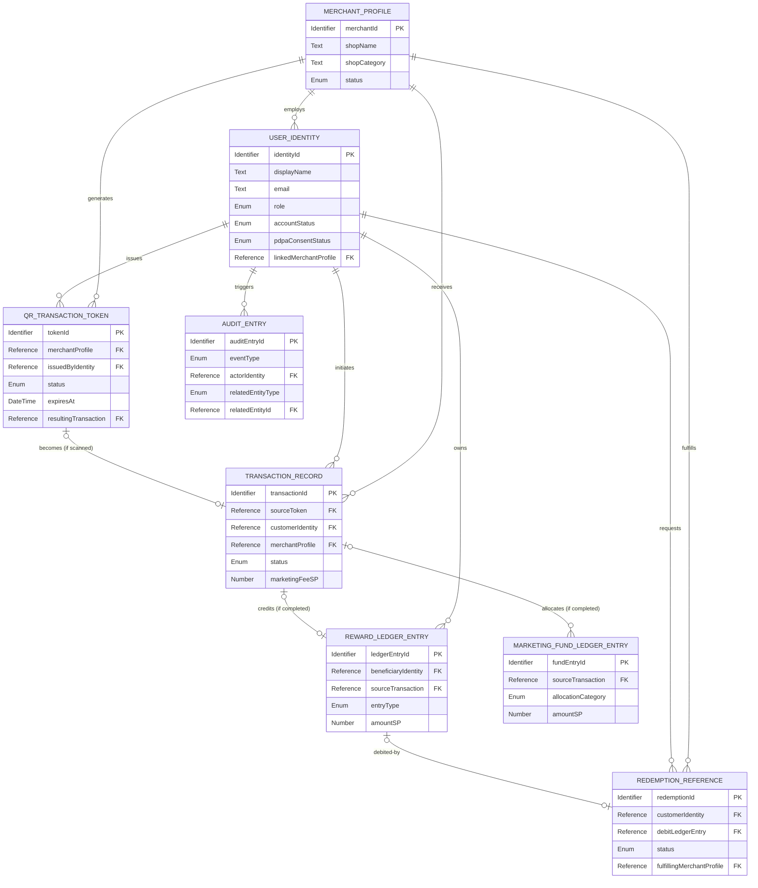

# ShopPlus Global — Database Schema (Conceptual)

**Version:** 1.2

**Last Updated:** 2026-08-24

**Document Owner:** Database Schema Designer Agent (AI Native Development Workflow)

**Source:** `01-requirements/03-feature-list.md` (v1.0), `02-design/04-user-journey.md` (v1.0), `02-design/03-system-architecture.md` (v2.2, §6 Key Conceptual Data Entities + §8.2 Known Platform Constraints)

---

## Revision History (ประวัติการปรับปรุงเอกสาร)

| Version | Date | Author/Agent | Description of Change |
|---|---|---|---|
| 1.0 | 2026-08-23 | Database Schema Designer Agent | เอกสารเริ่มต้น ขยาย 7 entity ใน `02-design/03-system-architecture.md` §6 ให้เป็น Entity Catalog ระดับ conceptual ครบ attribute, PDPA Classification, Relationships, และ ER Diagram พร้อมเพิ่ม entity ใหม่ **"QR Transaction Token"** (ยืนยันแนวทางจากผู้ใช้แล้ว — ดู §9 ข้อ 1) เพื่อรองรับ lifecycle ของ FT-002 ที่เกิดขึ้นก่อน Transaction Record จะถูกสร้าง |
| 1.1 | 2026-08-24 | Database Schema Designer Agent | ปรับ §8 "Current Technical Direction" ให้ครบ 4 หัวข้อย่อยตาม skill `data-api-design-standard` Section A ข้อ 8 ที่ปรับปรุงใหม่: คง Entity→Collection mapping เดิมเป็น §8.1, เพิ่ม §8.2 "Attribute → Firestore Data Type Mapping" และ §8.3 "Indexing Direction" (อิง query pattern จริงจาก `02-design/06-api-spec.md` §3), ย้ายหมายเหตุ SP wallet cache เข้า §8.4 — ไม่มีการเปลี่ยนแปลง entity/attribute/relationship ระดับ conceptual ใน §1–§7 |
| 1.2 | 2026-08-24 | Traceability & Consistency Auditor (sync จาก BRD v1.2 NFR Deep-Dive Review) | อัปเดต §5 แถว User Identity และ §9 ข้อ 6: retention period ของ Personal Data ตอบแล้ว (3 ปี หลัง `DEACTIVATED`, working decision) แทนข้อความ "ยังไม่มีคำตอบ" เดิม — แนวทาง anonymize ledger/audit โดยละเอียดยังเป็น Open Question เช่นเดิม (ไม่เปลี่ยน) |

---

## 1. Purpose & Scope (วัตถุประสงค์และขอบเขต)

เอกสารนี้ให้รายละเอียดระดับ **entity/table แบบ conceptual** ของ ShopPlus
Global — ขยาย "Key Conceptual Data Entities" ที่มีอยู่ใน
`02-design/03-system-architecture.md` §6 ให้ครบทุก attribute,
ความสัมพันธ์ระหว่าง entity, การจัดประเภทข้อมูลตาม PDPA, และ ER Diagram

เอกสารนี้**ยังไม่ผูกมัดกับ technology stack เฉพาะเจาะจง** — ไม่ระบุชื่อ
database engine, ประเภท relational/NoSQL, หรือ ORM ใด ๆ ยกเว้นใน §8
"Current Technical Direction (Non-Binding Reference)" เท่านั้น

**เอกสารนี้ไม่ครอบคลุม:**

- Field-level schema จริงของเทคโนโลยีที่เลือกใช้ (ดู
  `02-design/02-firestore-data-model.md` — เอกสารแยกอิสระ ไม่ได้ถูกแก้ไข
  หรือ merge เข้ากับเอกสารนี้)
- API specification/operation design (ดู `02-design/06-api-spec.md`)
- Transaction status state machine แบบละเอียดฝั่ง backend (ดู
  `02-design/01-transaction-flow.md`)

---

## 2. Entity Catalog (รายละเอียดแต่ละ Entity)

Conceptual Type ที่ใช้ในเอกสารนี้: `Identifier`, `Text`, `Number`,
`Boolean`, `Date/Time`, `Enum`, `Reference`, `Structured/JSON`

PDPA Classification: `Public/Non-Personal`, `Personal Data`,
`Sensitive Personal Data`

### 2.1 User Identity

บัญชีและ role ของ Customer/Merchant Staff/Admin พร้อมสถานะ PDPA consent
(ตรงกับ Architecture §6 "User Identity")

| Attribute | Conceptual Type | Required? | PDPA Classification | Description |
|---|---|---|---|---|
| identityId | Identifier | Yes | Public/Non-Personal | รหัสอ้างอิงบัญชีที่ไม่ซ้ำกัน |
| displayName | Text | Yes | Personal Data | ชื่อที่แสดงต่อผู้อื่นในระบบ — ใช้ display name เพื่อลดการเก็บชื่อจริงตามบัตร (data minimization) |
| email | Text | Yes | Personal Data | ใช้สำหรับ login และการติดต่อ |
| phoneNumber | Text | No | Personal Data | เก็บเฉพาะเมื่อ feature ที่เลือกใช้ต้องการ (เช่น แจ้งเตือนผ่าน SMS) |
| role | Enum(`CUSTOMER`, `MERCHANT_STAFF`, `ADMIN`) | Yes | Public/Non-Personal | กำหนดสิทธิ์ตาม RBAC (ดู §6 Access Control Matrix) |
| accountStatus | Enum(`ACTIVE`, `SUSPENDED`, `DEACTIVATED`) | Yes | Public/Non-Personal | ควบคุมโดย Admin (FT-011) |
| pdpaConsentStatus | Enum(`PENDING`, `GRANTED`, `WITHDRAWN`) | Yes | Personal Data | สถานะความยินยอมตาม PDPA (FT-016) — เป็นเงื่อนไขก่อนใช้ feature ที่เก็บข้อมูลอื่น |
| pdpaConsentTimestamp | Date/Time | Conditional (ต้องมีเมื่อ `GRANTED`/`WITHDRAWN`) | Personal Data | บันทึกเวลาที่ให้/ถอนความยินยอม เพื่อเป็นหลักฐาน compliance |
| linkedMerchantProfile | Reference → Merchant Profile | Conditional (ต้องมีเมื่อ role=`MERCHANT_STAFF`) | Public/Non-Personal | เชื่อมพนักงานร้านกับร้านค้าที่สังกัด |
| createdAt | Date/Time | Yes | Public/Non-Personal | เวลาที่สร้างบัญชี |
| updatedAt | Date/Time | Yes | Public/Non-Personal | เวลาที่แก้ไขล่าสุด |

**Business Rule Notes:** ต้องมี `pdpaConsentStatus = GRANTED` ก่อนที่
feature ใด ๆ ที่เก็บ personal data เพิ่มเติมจะทำงานได้ (FT-016, FT-017)
— ตรวจสอบที่ backend เท่านั้น (CLAUDE.md หมวด 6)

---

### 2.2 Merchant Profile

ข้อมูลร้านค้า (ชื่อ, ที่อยู่, ประเภท, เวลาเปิด-ปิด) (ตรงกับ Architecture
§6 "Merchant Profile")

| Attribute | Conceptual Type | Required? | PDPA Classification | Description |
|---|---|---|---|---|
| merchantId | Identifier | Yes | Public/Non-Personal | รหัสอ้างอิงร้านค้า |
| shopName | Text | Yes | Public/Non-Personal | ชื่อร้านค้า |
| shopCategory | Text | Yes | Public/Non-Personal | ประเภทร้านค้า |
| address | Text | Yes | Public/Non-Personal | ที่อยู่ร้านค้า (หมายเหตุ: ถ้าเป็นร้านที่ดำเนินการจากที่พักอาศัย อาจถือเป็น Personal Data ทางอ้อม ให้พิจารณาเพิ่มเติมตอน onboard จริง) |
| operatingHours | Structured/JSON | No | Public/Non-Personal | เวลาเปิด-ปิดร้าน |
| status | Enum(`ACTIVE`, `SUSPENDED`) | Yes | Public/Non-Personal | ควบคุมโดย Admin (FT-011) |
| createdAt | Date/Time | Yes | Public/Non-Personal | |
| updatedAt | Date/Time | Yes | Public/Non-Personal | |

**Business Rule Notes:** ต้องมี `status = ACTIVE` ก่อนที่จะออก QR
Transaction Token ได้ (FT-002)

---

### 2.3 QR Transaction Token *(New — แนะนำให้เพิ่มเข้า Architecture §6)*

**หมายเหตุ:** entity นี้ไม่มีอยู่ใน Architecture §6 ปัจจุบัน — เพิ่มขึ้น
ตามที่ผู้ใช้ยืนยันแนวทางไว้ในขั้นตอน Plan Proposal (ดู §9 ข้อ 1) เพื่อ
สะท้อน lifecycle ของโค้ดที่ FT-002 อธิบาย ซึ่งเกิดขึ้น**ก่อน**ที่
Transaction Record จะถูกสร้าง (merchant ออกโค้ด → รอสแกน → อาจหมดอายุ/
ถูกยกเลิกโดยยังไม่มี transaction เกิดขึ้นเลยก็ได้)

| Attribute | Conceptual Type | Required? | PDPA Classification | Description |
|---|---|---|---|---|
| tokenId | Identifier | Yes | Public/Non-Personal | รหัสอ้างอิงโค้ดที่ไม่ซ้ำกัน |
| merchantProfile | Reference → Merchant Profile | Yes | Public/Non-Personal | ร้านค้าที่ออกโค้ดนี้ |
| issuedByIdentity | Reference → User Identity | Yes | Public/Non-Personal | พนักงานร้านที่กดออกโค้ด (อ้างอิงเท่านั้น ไม่ duplicate ข้อมูลส่วนบุคคล) |
| status | Enum(`ISSUED`, `SCANNED`, `EXPIRED`, `CANCELLED`) | Yes | Public/Non-Personal | สถานะปัจจุบันของโค้ด |
| issuedAt | Date/Time | Yes | Public/Non-Personal | เวลาที่ออกโค้ด |
| expiresAt | Date/Time | Yes | Public/Non-Personal | เวลาหมดอายุ (single-use, มีเวลาจำกัดตาม FT-002) |
| cancelledAt | Date/Time | Conditional (ต้องมีเมื่อ `CANCELLED`) | Public/Non-Personal | เวลาที่ merchant ยกเลิกโค้ดด้วยมือ |
| scannedAt | Date/Time | Conditional (ต้องมีเมื่อ `SCANNED`) | Public/Non-Personal | เวลาที่ customer สแกนสำเร็จ |
| resultingTransaction | Reference → Transaction Record | Conditional (ต้องมีเมื่อ `SCANNED`) | Public/Non-Personal | Transaction Record ที่ถูกสร้างจากการสแกนโค้ดนี้ |

**Business Rule Notes:** ใช้ได้ครั้งเดียว (single-use) — เปลี่ยนเป็น
`SCANNED` ทันทีที่สแกนสำเร็จและห้ามสแกนซ้ำ; ยกเลิกด้วยมือได้เฉพาะขณะ
`status = ISSUED` เท่านั้น (FT-002); โค้ดที่เกิน `expiresAt` โดยยังไม่ถูก
สแกนต้องเปลี่ยนเป็น `EXPIRED`

---

### 2.4 Transaction Record

หนึ่งรอบ QR-scan-ถึง-completion พร้อม status lifecycle (ตรงกับ
Architecture §6 "Transaction Record")

| Attribute | Conceptual Type | Required? | PDPA Classification | Description |
|---|---|---|---|---|
| transactionId | Identifier | Yes | Public/Non-Personal | รหัสอ้างอิง transaction |
| sourceToken | Reference → QR Transaction Token | Yes | Public/Non-Personal | โค้ดต้นทางที่ถูกสแกนจนเกิด transaction นี้ |
| customerIdentity | Reference → User Identity | Yes | Public/Non-Personal | ลูกค้าที่สแกน (อ้างอิงเท่านั้น) |
| merchantProfile | Reference → Merchant Profile | Yes | Public/Non-Personal | ร้านค้าปลายทาง |
| status | Enum(`PENDING_APPROVAL`, `APPROVED`, `REJECTED`, `CANCELLED`, `COMPLETED`) | Yes | Public/Non-Personal | ตาม status lifecycle ที่ Architecture §6 กำหนด |
| marketingFeeSP | Number | Yes | Public/Non-Personal | ค่า marketing fee เป็น SP — ต้อง ≥ 30 SP เสมอ (CLAUDE.md หมวด 4) |
| approvedByIdentity | Reference → User Identity | Conditional (ต้องมีเมื่อ `APPROVED`/`REJECTED`) | Public/Non-Personal | พนักงานร้านที่อนุมัติ/ปฏิเสธ |
| createdAt | Date/Time | Yes | Public/Non-Personal | |
| completedAt | Date/Time | Conditional (ต้องมีเมื่อ `COMPLETED`) | Public/Non-Personal | |

**Business Rule Notes:** status transition ต้องเป็นไปตามลำดับที่กำหนด
เท่านั้น (`PENDING_APPROVAL` → `APPROVED`/`REJECTED`/`CANCELLED` →
`COMPLETED`); `marketingFeeSP` ต้อง ≥ 30 SP เสมอ (10 SP = 1 บาท,
marketing fee ขั้นต่ำ 3 บาท ตาม CLAUDE.md หมวด 4); ห้าม client กำหนดค่า
`status` หรือ `marketingFeeSP` เอง ต้องคำนวณ/ควบคุมที่ backend เท่านั้น
(CLAUDE.md หมวด 6)

---

### 2.5 Reward Ledger Entry

บันทึก SP Point ที่ Customer ได้รับ/ใช้ — immutable (ตรงกับ Architecture
§6 "Reward Ledger Entry")

| Attribute | Conceptual Type | Required? | PDPA Classification | Description |
|---|---|---|---|---|
| ledgerEntryId | Identifier | Yes | Public/Non-Personal | |
| beneficiaryIdentity | Reference → User Identity | Yes | Public/Non-Personal | เจ้าของ SP ที่เกี่ยวข้อง (อ้างอิงเท่านั้น) |
| sourceTransaction | Reference → Transaction Record | Conditional (ต้องมีเมื่อ `entryType = TRANSACTION_REWARD_CREDIT`) | Public/Non-Personal | transaction ต้นทางของการได้รับ SP |
| entryType | Enum(`TRANSACTION_REWARD_CREDIT`, `REDEMPTION_DEBIT`) | Yes | Public/Non-Personal | ทิศทางการเคลื่อนไหวของ SP |
| amountSP | Number | Yes | Public/Non-Personal | จำนวน SP — คงที่ 10 SP ต่อ transaction ที่ `COMPLETED` (CLAUDE.md หมวด 4) สำหรับ `TRANSACTION_REWARD_CREDIT` |
| createdAt | Date/Time | Yes | Public/Non-Personal | |

**Business Rule Notes:** entry เป็น **immutable** ห้ามแก้ไข/ลบ
(audit-first design); SP Balance ปัจจุบันของ customer คือค่าที่คำนวณจาก
ผลรวม entry ทั้งหมดของ customer นั้น ไม่ใช่ field แยกในเอกสารนี้ (ดู §8
สำหรับแนวทาง cache จริงฝั่งเทคนิค)

---

### 2.6 Marketing Fund Ledger Entry

บันทึกส่วนแบ่งของ marketing fund/platform จาก Transaction ที่ completed
(ตรงกับ Architecture §6 "Marketing Fund Ledger Entry")

| Attribute | Conceptual Type | Required? | PDPA Classification | Description |
|---|---|---|---|---|
| fundEntryId | Identifier | Yes | Public/Non-Personal | |
| sourceTransaction | Reference → Transaction Record | Yes | Public/Non-Personal | |
| allocationCategory | Enum(`MARKETING_FUND`, `PLATFORM_REVENUE`) | Yes | Public/Non-Personal | ส่วนแบ่งตามกฎ 10/10/10 |
| amountSP | Number | Yes | Public/Non-Personal | คงที่ 10 SP ต่อ category ต่อ transaction ที่ `COMPLETED` (CLAUDE.md หมวด 4) |
| linkedCampaign | Reference (เตรียมไว้สำหรับอนาคต — ยังไม่มี entity รองรับ) | No | Public/Non-Personal | สำหรับ FT-020 (Merchant Campaigns, Post-MVP/Could have) — ไม่บังคับใช้ใน MVP |
| createdAt | Date/Time | Yes | Public/Non-Personal | |

**Business Rule Notes:** entry เป็น **immutable** เช่นเดียวกับ Reward
Ledger Entry

---

### 2.7 Redemption Reference

คำขอแลก reward ของ Customer ที่รอการ fulfill ที่ร้าน (ตรงกับ
Architecture §6 "Redemption Reference")

| Attribute | Conceptual Type | Required? | PDPA Classification | Description |
|---|---|---|---|---|
| redemptionId | Identifier | Yes | Public/Non-Personal | |
| customerIdentity | Reference → User Identity | Yes | Public/Non-Personal | ผู้ขอแลก (อ้างอิงเท่านั้น) |
| debitLedgerEntry | Reference → Reward Ledger Entry | Yes | Public/Non-Personal | entry ประเภท `REDEMPTION_DEBIT` ที่เกิดจากการแลกนี้ |
| amountSP | Number | Yes | Public/Non-Personal | จำนวน SP ที่ใช้แลก |
| status | Enum(`PENDING_FULFILLMENT`, `FULFILLED`) | Yes | Public/Non-Personal | |
| fulfillingMerchantProfile | Reference → Merchant Profile | Conditional (ต้องมีเมื่อ `FULFILLED`) | Public/Non-Personal | ร้านที่ทำการ fulfill |
| issuedAt | Date/Time | Yes | Public/Non-Personal | |
| fulfilledAt | Date/Time | Conditional (ต้องมีเมื่อ `FULFILLED`) | Public/Non-Personal | |

**Business Rule Notes:** ใช้ได้ครั้งเดียว — ป้องกันการ fulfill ซ้ำ
(FT-008); ต้องตรวจสอบว่า SP balance เพียงพอก่อนสร้าง entry นี้ (FT-007)

---

### 2.8 Audit Entry

บันทึก immutable ของทุก action สำคัญที่เปลี่ยนแปลง state (ตรงกับ
Architecture §6 "Audit Entry")

| Attribute | Conceptual Type | Required? | PDPA Classification | Description |
|---|---|---|---|---|
| auditEntryId | Identifier | Yes | Public/Non-Personal | |
| eventType | Enum (เช่น `TRANSACTION_CREATED`, `TRANSACTION_APPROVED`, `TRANSACTION_REJECTED`, `TRANSACTION_CANCELLED`, `SP_DISTRIBUTED`, `REDEMPTION_ISSUED`, `REDEMPTION_FULFILLED`, `QR_TOKEN_CANCELLED`, `ACCOUNT_SUSPENDED`) | Yes | Public/Non-Personal | ประเภทเหตุการณ์ |
| actorIdentity | Reference → User Identity | Conditional (ไม่มีเมื่อเหตุการณ์เกิดจากระบบล้วน) | Personal Data | ผู้กระทำ (อ้างอิง reference id เท่านั้น ไม่ duplicate ข้อมูลส่วนบุคคลอื่นเพื่อ data minimization) |
| actorRole | Enum(`CUSTOMER`, `MERCHANT`, `ADMIN`, `SYSTEM`) | Yes | Public/Non-Personal | |
| relatedEntityType | Enum(`TRANSACTION_RECORD`, `QR_TRANSACTION_TOKEN`, `REDEMPTION_REFERENCE`, `USER_IDENTITY`, `MERCHANT_PROFILE`) | Yes | Public/Non-Personal | ประเภทของ entity ต้นทางที่เหตุการณ์นี้เกี่ยวข้อง |
| relatedEntityId | Reference (polymorphic ไปยัง entity ตาม `relatedEntityType`) | Yes | Public/Non-Personal | |
| metadata | Structured/JSON | No | Public/Non-Personal (ห้ามใส่ personal data เพิ่มเติมที่ไม่จำเป็น — data minimization) | บริบทเพิ่มเติมของเหตุการณ์ |
| occurredAt | Date/Time | Yes | Public/Non-Personal | |

**Business Rule Notes:** **immutable โดยสมบูรณ์** ห้าม update/delete
แม้แต่ Admin (audit-first design ตาม CLAUDE.md หมวด 10)

---

## 3. Relationships (ความสัมพันธ์ระหว่าง Entity)

| Entity A | Relationship | Entity B | คำอธิบาย |
|---|---|---|---|
| Merchant Profile | 1 : N | User Identity | 1 ร้านมีพนักงาน (role=MERCHANT_STAFF) ได้หลายคน — *assumption, ดู §9 ข้อ 7* |
| Merchant Profile | 1 : N | QR Transaction Token | ร้านหนึ่งออกโค้ดได้หลายใบ |
| User Identity | 1 : N | QR Transaction Token | พนักงานคนหนึ่งออกโค้ดได้หลายใบ (`issuedByIdentity`) |
| QR Transaction Token | 1 : 0..1 | Transaction Record | โค้ดหนึ่งใบก่อให้เกิด transaction ได้อย่างมาก 1 รายการ (เมื่อถูกสแกนสำเร็จ) |
| User Identity | 1 : N | Transaction Record | ลูกค้าหนึ่งคนสร้าง transaction ได้หลายรายการ |
| Merchant Profile | 1 : N | Transaction Record | ร้านหนึ่งรับ transaction ได้หลายรายการ |
| Transaction Record | 1 : 0..1 | Reward Ledger Entry | transaction ที่ `COMPLETED` เท่านั้นที่สร้าง entry ประเภท credit |
| Transaction Record | 1 : 0..2 | Marketing Fund Ledger Entry | transaction ที่ `COMPLETED` สร้าง entry 2 รายการ (MARKETING_FUND + PLATFORM_REVENUE) |
| User Identity | 1 : N | Reward Ledger Entry | ลูกค้าหนึ่งคนมี ledger entry ได้หลายรายการ |
| Reward Ledger Entry | 1 : 0..1 | Redemption Reference | entry ประเภท `REDEMPTION_DEBIT` แต่ละรายการผูกกับการแลก 1 ครั้ง |
| User Identity | 1 : N | Redemption Reference | ลูกค้าหนึ่งคนขอแลกได้หลายครั้ง |
| Merchant Profile | 1 : N | Redemption Reference | ร้านหนึ่งทำการ fulfill ได้หลายรายการ |
| User Identity / Transaction Record / QR Transaction Token / Redemption Reference / Merchant Profile | 1 : N | Audit Entry | ทุก entity หลักอ้างอิงถูกอ้างจาก Audit Entry ได้หลายรายการ (polymorphic ผ่าน `relatedEntityType`/`relatedEntityId`) |

---

## 4. ER Diagram

---

## 5. Data Lifecycle & Retention (วงจรชีวิตข้อมูลและการเก็บรักษา)

| Entity | แนวทาง Retention/Minimization เชิงแนวคิด |
|---|---|
| User Identity | เก็บระหว่างบัญชียัง `ACTIVE`; เมื่อ `DEACTIVATED` ให้เก็บต่อไม่เกิน **3 ปี** (working decision ตาม BRD §7 v1.2 — FT-018 ยัง Blocked บางส่วน เพราะ consent flow โดยละเอียดยังไม่มีคำตอบ) จากนั้น anonymize/ลบ `displayName`, `email`, `phoneNumber` ตามสิทธิ์ที่ user ร้องขอ (PDPA) |
| pdpaConsentStatus / pdpaConsentTimestamp | เก็บถาวรเป็นหลักฐาน compliance แม้บัญชีจะถูกปิดแล้ว เว้นแต่กฎหมายกำหนดเป็นอื่น |
| Merchant Profile | เก็บระหว่างร้านยัง `ACTIVE`; ระงับ (`SUSPENDED`) ไม่ใช่การลบ — การลบจริงต้องผ่านกระบวนการ admin แยกต่างหาก |
| QR Transaction Token | ไม่ใช่ personal data — เก็บสั้น อาจ archive/purge หลังหมดอายุตามระยะเวลาดำเนินงาน (operational retention เท่านั้น ไม่ผูก PDPA) |
| Transaction Record / Reward Ledger Entry / Marketing Fund Ledger Entry / Audit Entry | เก็บถาวรตามหลัก audit trail (**ห้ามลบ**) เพื่อการสอบสวนกรณีพิพาทและตรวจสอบทางบัญชี — เมื่อ user ใช้สิทธิ์ PDPA ขอลบ/anonymize ข้อมูลส่วนตัว ต้อง anonymize เฉพาะการอ้างอิงตัวตน (เช่นแทนที่ `customerIdentity`/`actorIdentity` ด้วยค่าที่ไม่ระบุตัวตนได้) โดยยังคง integrity ของยอด SP/audit ไว้ — **แนวทาง anonymize ที่ชัดเจนยังเป็น Open Question (ดู §9 ข้อ 6)** |
| Redemption Reference | เก็บตามหลัก audit trail เช่นเดียวกับ Transaction Record |

---

## 6. Access Control Matrix (ตารางสิทธิ์การเข้าถึง)

สอดคล้องกับ `02-design/03-system-architecture.md` §7 "Security & Access
Control"

| Entity | Customer | Merchant | Admin |
|---|---|---|---|
| User Identity | Read/Write เฉพาะของตนเอง (เฉพาะ field ที่อนุญาตแก้ไขเอง) | Read เฉพาะพนักงานในร้านตนเอง | Read/Write ทั้งหมด (สร้าง/อัปเดต/ระงับ ตาม FT-011) |
| Merchant Profile | Read (เฉพาะข้อมูล public เช่นตอน discovery) | Read/Write เฉพาะร้านตนเอง | Read/Write ทั้งหมด (ระงับได้ตาม FT-011) |
| QR Transaction Token | ไม่มีสิทธิ์เข้าถึงโดยตรง (เห็นผลผ่าน Transaction Record ที่เกิดจากการสแกน) | Read/Write (สร้าง/ยกเลิก) เฉพาะร้านตนเอง | Read ทั้งหมด (ตรวจสอบ) |
| Transaction Record | Read เฉพาะของตนเอง | Read/Write (อนุมัติ/ปฏิเสธ) เฉพาะร้านตนเอง | Read ทั้งหมด, Write เฉพาะการยกเลิกด้วยมือ (FT-014) |
| Reward Ledger Entry | Read เฉพาะของตนเอง | ไม่มีสิทธิ์เข้าถึงโดยตรง | Read ทั้งหมด (ตรวจสอบ), ห้าม Write โดยตรง (สร้างผ่าน business logic เท่านั้น) |
| Marketing Fund Ledger Entry | ไม่มีสิทธิ์เข้าถึง | Read เฉพาะที่เกี่ยวกับร้านตนเอง (reconciliation, FT-010) | Read ทั้งหมด, ห้าม Write โดยตรง |
| Redemption Reference | Read/Write (สร้าง) เฉพาะของตนเอง | Read/Write (fulfill) เฉพาะรายการที่นำมาแสดงที่ร้านตนเอง | Read ทั้งหมด |
| Audit Entry | ไม่มีสิทธิ์เข้าถึง | ไม่มีสิทธิ์เข้าถึง | Read ทั้งหมด (สอบสวน), **ห้าม Write/Delete แม้แต่ Admin** (immutable) |

**หมายเหตุ:** "Write" ในตารางนี้หมายถึง "ร้องขอให้ backend ดำเนินการ"
เท่านั้น — การคำนวณ/ตรวจสอบสิทธิ์จริงต้องอยู่ฝั่ง backend เสมอ (CLAUDE.md
หมวด 6)

---

## 7. Traceability

| Entity | ที่มา (Architecture §6) | Related FT-xxx | Related Journey Step |
|---|---|---|---|
| User Identity | User Identity | FT-001, FT-011, FT-016, FT-017 | Register/Login, PDPA Consent (Customer Journey); Manage Accounts (Admin Journey) |
| Merchant Profile | Merchant Profile | FT-009, FT-011 | Onboard/จัดการโปรไฟล์ร้านค้า (Merchant Journey) |
| QR Transaction Token | *New — ดู §9 ข้อ 1* | FT-002 | สร้าง QR Code สำหรับ transaction ใหม่ (Merchant Journey) |
| Transaction Record | Transaction Record | FT-003, FT-005, FT-014 | สแกน QR / รอผลอนุมัติ (Customer Journey), Review Pending Queue/Approve-Reject (Merchant Journey), Manual Cancellation (Admin Journey) |
| Reward Ledger Entry | Reward Ledger Entry | FT-004, FT-006 | SP ถูกแบ่งสรร / ดู SP Balance (Customer Journey) |
| Marketing Fund Ledger Entry | Marketing Fund Ledger Entry | FT-006, FT-010 | SP Distribution Triggered / Fee & Transaction Reconciliation (Merchant Journey) |
| Redemption Reference | Redemption Reference | FT-007, FT-008 | แลก reward (Customer Journey), Redemption Fulfillment (Merchant Journey) |
| Audit Entry | Audit Entry | FT-014, FT-015 | ทำเครื่องหมาย fulfilled (Merchant Journey), View Audit Log (Admin Journey) |

---

## 8. Current Technical Direction (Non-Binding Reference)

> ส่วนนี้สะท้อนทิศทางเทคนิคปัจจุบันตาม CLAUDE.md หมวด 6 เท่านั้น ไม่ใช่
> constraint ของ data model ระดับแนวคิดข้างต้น และเปลี่ยนแปลงได้โดยไม่
> กระทบโครงสร้าง entity/ความสัมพันธ์ที่อธิบายไว้

### 8.1 Entity → Firestore Collection Mapping

รายละเอียด field-level schema จริงของทิศทาง Firestore ปัจจุบันอยู่ที่
`02-design/02-firestore-data-model.md` (เอกสารแยกอิสระ ไม่ได้ถูกแก้ไข
โดย agent นี้) สรุป mapping คร่าว ๆ ดังนี้:

| Conceptual Entity (เอกสารนี้) | Firestore Collection ที่ใกล้เคียงที่สุด | Document ID Strategy | หมายเหตุ |
|---|---|---|---|
| User Identity | `users` (root collection) | Auto-generated ID | ตรงกัน |
| Merchant Profile | `merchants` (root collection) | Auto-generated ID | ตรงกัน |
| QR Transaction Token | *(ไม่มี collection แยกในเอกสารเดิม — ปัจจุบันเป็นแค่ field `qrCodeId` ใน `transactions`)* | — | ช่องว่างทางเทคนิค — ถ้ารับแนวทาง entity ใหม่นี้ ควรอัปเดต `02-firestore-data-model.md` ให้มี collection รองรับ lifecycle ก่อนถูกสแกน (เช่น root collection `qrTokens` ใช้ custom ID = token code) |
| Transaction Record | `transactions` (root collection) | Auto-generated ID | ตรงกัน — เอกสารเดิมมี status เพิ่มเติม (`PROCESSING`, `FAILED`, `EXPIRED`) ที่มาจาก `01-transaction-flow.md` ไม่ใช่จาก Architecture §6 (ดู §9 ข้อ 2) |
| Reward Ledger Entry | `spLedger` (entry ที่ `type = CUSTOMER_REWARD`) | Auto-generated ID | ตรงกันบางส่วน |
| Marketing Fund Ledger Entry | `spLedger` (entry ที่ `type = MARKETING_FUND`/`SHOPPLUS_REVENUE`) + `marketingFunds` | Auto-generated ID | ตรงกันบางส่วน |
| Redemption Reference | *(ไม่มี collection รองรับในเอกสารเดิม)* | — | ช่องว่างทางเทคนิค — ต้องเพิ่มเมื่อ implement FT-007/FT-008 จริง (เช่น root collection `redemptions` ใช้ auto-generated ID) |
| Audit Entry | `transactions/{transactionId}/events` (`transactionEvents`, subcollection) | Auto-generated ID | denormalize ใต้ transaction — ครอบคลุมเฉพาะเหตุการณ์ระดับ transaction — ยังไม่ครอบคลุม audit ของ entity อื่น (เช่น account suspension) |

### 8.2 Attribute → Firestore Data Type Mapping

Conceptual Type ที่ใช้ใน §2 ข้างต้น → Firestore data type ที่สอดคล้อง:

| Conceptual Type (§2) | Firestore Data Type | หมายเหตุ |
|---|---|---|
| `Identifier` | Firestore Document ID (auto-generated) หรือ `string` field เมื่อถูกอ้างจาก document อื่น | ดู Document ID Strategy ใน §8.1 ต่อ entity |
| `Text` | `string` | |
| `Number` | `number` (integer) | เช่น `amountSP` |
| `Boolean` | `boolean` | |
| `Date/Time` | `Timestamp` | |
| `Enum` | `string` พร้อม comment ระบุค่าที่เป็นไปได้ในโค้ด (Firestore ไม่มี native enum type) | เช่น `status`, `pdpaConsentStatus` |
| `Reference` | `string` เก็บ ID ของ document ปลายทาง (แนวทางที่เอกสารเดิม `02-firestore-data-model.md` ส่วนใหญ่ใช้ เพื่อความง่ายในการ query) — ทางเลือกอื่นคือ `DocumentReference` แต่ยังไม่ถูกเลือกใช้จริง | ระบุเป็น "ยังไม่กำหนดเป็นทางเลือกสุดท้าย" ถ้าไม่มีหลักฐานจากเอกสารเดิม |
| `Structured/JSON` | `Map` (nested object) | |

### 8.3 Indexing Direction (แนวทาง Index เบื้องต้น)

รายการ composite index ที่คาดว่าจำเป็น โดยอ้างอิงจาก query pattern ที่
ระบุไว้ใน Operation Catalog ของ `02-design/06-api-spec.md` §3:

| Query Pattern (Operation ต้นทาง) | Entity | Suggested Composite Index | หมายเหตุ |
|---|---|---|---|
| View Pending Transaction Queue (§3.4) | Transaction Record | `merchantId` ASC, `status` ASC | กรอง 2 field พร้อมกัน (merchant ตนเอง + `PENDING_APPROVAL`) |
| View Own Transaction History (§3.4) | Transaction Record | `customerId` ASC, `createdAt` DESC | เรียงตามเวลาล่าสุดก่อน |
| View Transaction Monitoring Aggregate (§3.4) | Transaction Record | ไม่ต้อง composite index — นับจำนวนแยกตาม `status` (single-field index เพียงพอ หรือใช้ aggregation query) | เป็น read-only aggregate ทั้งระบบ |
| View SP Balance & Reward Ledger (§3.5) | Reward Ledger Entry | `customerId` ASC, `createdAt` DESC | |
| View Marketing Fee Reconciliation (§3.5) | Transaction Record, Marketing Fund Ledger Entry | `merchantId` ASC, `createdAt` ASC/DESC (range filter ตามช่วงวันที่) | ต้องมี index แยกต่อ entity เพราะเป็นสอง collection คนละที่ (ไม่มี join ตรง — ดู Architecture §8.2) |
| Search Audit Log (§3.7) | Audit Entry | `relatedEntityId` ASC, `createdAt` DESC | ขึ้นกับการแก้ gap ใน §8.1 (ปัจจุบันเป็น subcollection ใต้ transaction เท่านั้น จึง query ข้าม entity อื่นไม่ได้โดยตรง) |

### 8.4 Cross-Reference เอกสารเทคนิคเดิม

ดู `02-design/02-firestore-data-model.md` สำหรับ field-level schema จริง
ทั้งหมด (เอกสารแยกอิสระ ไม่ได้ถูกแก้ไขหรือ merge เข้ากับเอกสารนี้) — SP
Balance ปัจจุบัน (ผลรวมของ Reward Ledger Entry) ฝั่งเทคนิคปัจจุบัน cache
ไว้ใน collection `spWallets` เพื่อประสิทธิภาพ เป็นรายละเอียด
implementation ที่ไม่กระทบ conceptual model ใน §1–§7 ข้างต้น

---

## 9. Open Questions / Assumptions (ประเด็นที่ยังไม่ชัดเจน)

1. **QR Transaction Token เป็น entity ใหม่ที่ Architecture §6 ยังไม่มี** —
   ผู้ใช้ยืนยันแนวทางนี้แล้วในขั้นตอน Plan Proposal ของรอบนี้ — แนะนำให้
   เพิ่มเข้า `02-design/03-system-architecture.md` §6 อย่างเป็นทางการใน
   รอบแก้ไขถัดไป
2. **Transaction status enum ไม่ตรงกันข้ามเอกสาร (มีอยู่ก่อนรอบนี้)** —
   เอกสารนี้ใช้ชุดสถานะจาก Architecture §6
   (`PENDING_APPROVAL`/`APPROVED`/`REJECTED`/`CANCELLED`/`COMPLETED`)
   ซึ่งตรงกับ Feature List (FT-014) และ User Journey (Admin Journey) แต่
   **ต่างจาก** `02-design/01-transaction-flow.md` ที่มี `PROCESSING`/
   `FAILED` เพิ่มเติมและ**ไม่มี** `CANCELLED` เลย — เป็นความไม่สอดคล้อง
   ข้ามเอกสารที่มีอยู่ก่อนงานนี้ แนะนำให้ `traceability-consistency-auditor`
   พิจารณาว่าควร reconcile อย่างไร (ดูสรุปท้ายคำตอบ)
3. **Merchant multi-branch support** — `02-design/02-firestore-data-model.md`
   เดิมรองรับ merchant หลายสาขา (`merchantBranches`) แต่ Feature
   List/Architecture §6/User Journey ปัจจุบันไม่มี feature/entity รองรับ
   multi-branch อย่างชัดเจน — ไม่ได้จำลอง Branch entity ไว้ในรอบนี้
   เพราะไม่มีที่มาจากเอกสารต้นทางปัจจุบัน ถ้าต้องการให้รองรับ ต้องเพิ่ม
   FT ใหม่ก่อน
4. **Campaign entity** — เตรียม field `linkedCampaign` ไว้ใน Marketing
   Fund Ledger Entry สำหรับ FT-020 (Merchant Campaigns, Post-MVP/Could
   have) แต่ยังไม่มี entity รองรับจริง เพราะ FT-020 ยังไม่เข้า scope MVP
5. **Redemption Reference ยังไม่มี technical mapping** ใน
   `02-design/02-firestore-data-model.md` เดิม — เป็นช่องว่างที่ควร
   อัปเดตเอกสารเทคนิคเมื่อ implement FT-007/FT-008 จริง (ดู §8)
6. **Data retention period สำหรับ Personal Data ตอบแล้วบางส่วน (v1.2):**
   BRD §7 กำหนด working decision = 3 ปี หลัง `DEACTIVATED` (ดู §5 แถว
   User Identity) แต่ **consent flow โดยละเอียด** (ส่วนที่เหลือของ BRD
   Open Question 4) และ **แนวทาง anonymize ledger/audit ที่ชัดเจน**
   ยังเป็น Open Question อยู่ — FT-018 จึงยัง Blocked บางส่วน
7. **Cardinality ระหว่าง Merchant Profile กับ User Identity (staff)** —
   สมมติว่า 1 ร้านมีพนักงานได้หลายคน (1:N) ยังไม่มี FT ที่ยืนยันเรื่อง
   multi-staff อย่างชัดเจน เป็น assumption ที่ควร validate กับ
   stakeholder
