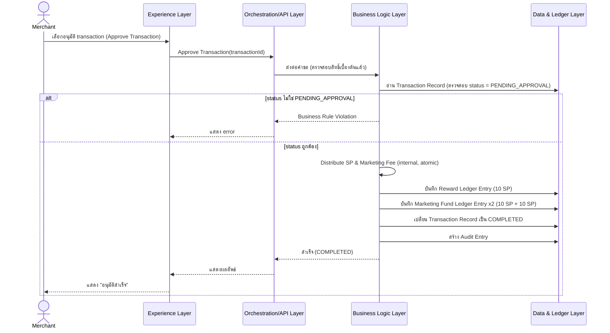

# ShopPlus Global — API Specification (Conceptual)

**Version:** 1.2

**Last Updated:** 2026-08-24

**Document Owner:** API Spec Designer Agent (AI Native Development Workflow)

**Source:** `01-requirements/03-feature-list.md` (v1.0), `02-design/04-user-journey.md` (v1.0), `02-design/03-system-architecture.md` (v2.2, §3 + §7), `02-design/05-database-schema.md` (v1.1)

---

## Revision History (ประวัติการปรับปรุงเอกสาร)

| Version | Date | Author/Agent | Description of Change |
|---|---|---|---|
| 1.0 | 2026-08-23 | API Spec Designer Agent | เอกสารเริ่มต้น กำหนด Operation Catalog ระดับ conceptual ครอบคลุม FT-001–FT-011, FT-013–FT-017 (ทุก Feature ที่มี entity/journey step รองรับใน Database Schema ปัจจุบัน) พร้อม Resource ↔ Entity Mapping, Interaction Diagram สำหรับ "Approve Transaction", และ Error Handling Convention — ผู้ใช้ยืนยัน Plan Proposal แล้วก่อนเริ่มเขียน (รวม FT-012 เป็น Operation แบบไม่อ้าง entity) |
| 1.1 | 2026-08-24 | API Spec Designer Agent | ปรับ §7 "Current Technical Direction" ให้ครบ 4 หัวข้อย่อยตาม skill `data-api-design-standard` Section B ข้อ 7 ที่ปรับปรุงใหม่: เพิ่ม §7.1 "Operation → Cloud Function Mapping" ครบทุก operation ใน §3, §7.2 "Auth & Transport Notes", §7.3 "Error Mapping" ไปยัง `HttpsError` code, และ §7.4 Cross-Reference — ไม่มีการเปลี่ยนแปลง operation/request/response ระดับ conceptual ใน §1–§6 |
| 1.2 | 2026-08-24 | Traceability & Consistency Auditor (sync จาก BRD v1.2 NFR Deep-Dive Review) | อัปเดต Open Item ข้อ 5: FT-019 ตอบแล้ว (SLA 48 ชั่วโมง, ปลด Blocked — รอ implement operation auto-cancel), FT-018 ยัง Blocked บางส่วน (retention period ตอบแล้ว 3 ปี, consent flow ยังไม่ตอบ) |

---

## 1. Purpose & Scope (วัตถุประสงค์และขอบเขต)

เอกสารนี้ให้รายละเอียด **Operation/Resource ระดับ conceptual** ของ
ShopPlus Global — อธิบายว่าระบบต้องมีความสามารถ (capability) อะไรบ้าง
สำหรับแต่ละ actor ตาม `02-design/04-user-journey.md` และ entity ที่กำหนด
ไว้ใน `02-design/05-database-schema.md`

เอกสารนี้อธิบายเป็น **"Operation"** ระดับความสามารถเท่านั้น — **ไม่ผูก
กับ protocol** (REST/GraphQL/gRPC/Firebase Callable Function), HTTP
method, หรือ URL scheme ใด ๆ รายละเอียด protocol จริงอยู่ใน §7 "Current
Technical Direction (Non-Binding Reference)" เท่านั้น

**เอกสารนี้ไม่ครอบคลุม:**

- Entity/attribute-level schema (ดู `02-design/05-database-schema.md`)
- Layer/component ระดับระบบ (ดู `02-design/03-system-architecture.md`)
- Sequence flow แบบเต็มรูปแบบต่อทุก Scenario (ดู
  `02-design/07-detailed-design.md` — จะจัดทำในขั้นตอนถัดไป มีเฉพาะ
  Interaction Diagram แบบ "แนะนำ" สำหรับ operation ที่ซับซ้อนที่สุดใน §4
  ของเอกสารนี้เท่านั้น)

**ขอบเขต Feature ที่ครอบคลุมในรอบนี้ (ตาม Plan ที่ยืนยันแล้ว):**
FT-001, FT-002, FT-003, FT-004, FT-005, FT-006, FT-007, FT-008, FT-009,
FT-010, FT-011, FT-012 (ไม่มี entity รองรับโดยตรง — ดูหมายเหตุใน §2),
FT-013, FT-014, FT-015, FT-016, FT-017

**ไม่รวมในรอบนี้:** FT-018, FT-019 (ยัง Blocked จาก BRD Open Question),
FT-020, FT-021, FT-022, FT-023 (Post-MVP/Won't have — ไม่มี journey step
ที่ชัดเจนใน User Journey ปัจจุบัน เช่นเดียวกับที่ Architecture §5 ไม่ได้
ทำ data flow ให้)

---

## 2. Resource ↔ Entity Mapping

| Resource | Entity ที่เกี่ยวข้อง (จาก `05-database-schema.md`) | คำอธิบาย |
|---|---|---|
| Identity & Account | User Identity | บัญชี, authentication, PDPA consent, profile ของ Customer/Merchant Staff/Admin |
| Merchant Profile | Merchant Profile | ข้อมูลร้านค้าและสถานะ |
| QR Transaction Token | QR Transaction Token | วงจรชีวิตของโค้ดก่อนถูกสแกน |
| Transaction | Transaction Record | วงจรชีวิตของ transaction ตั้งแต่สแกนจนถึง completion |
| Reward & Marketing Fee Ledger | Reward Ledger Entry, Marketing Fund Ledger Entry | การแบ่งสรร SP และการดูยอด |
| Redemption | Redemption Reference | คำขอแลกและการ fulfill |
| Audit Log | Audit Entry | บันทึก immutable และการค้นหาเพื่อสอบสวน |
| Reward Rule Configuration | *(ไม่มี entity — ค่าคงที่ระดับ Business Logic configuration)* | ค่ากฎ SP Point (30 SP: 10/10/10) ตาม CLAUDE.md หมวด 4 — เป็นค่าคงที่ที่ deploy พร้อมระบบ ไม่ใช่ record ที่แก้ไขผ่าน operation ใน MVP (FT-012 ระบุว่า read-only) |

---

## 3. Operation Catalog (รายละเอียดแต่ละ Operation)

หมวดหมู่ Error/Exception ที่ใช้ร่วมกันทุก operation (นิยามเต็มใน §5):
`Validation Error`, `Authorization Error`, `Business Rule Violation`,
`Not Found`, `Conflict/Idempotency Violation`

### 3.1 Resource: Identity & Account

**Operation: Register Customer Account**
- Actor(s): Customer
- Trigger: Customer Journey ขั้นตอน 1 "เปิดแอปครั้งแรก / Register" — FT-001
- Request: displayName, email, phoneNumber (optional), Authentication Credential (กลไกจริงยังไม่ระบุ — ดู §7; ไม่ใช่ attribute ใน User Identity entity เพราะไม่เก็บ credential ดิบตาม data minimization)
- Response: identityId, role=`CUSTOMER`, accountStatus=`ACTIVE`, pdpaConsentStatus=`PENDING`
- Business Rules Invoked: สร้างบัญชีด้วย `pdpaConsentStatus = PENDING` เสมอ — ยังไม่ปลดล็อก feature ที่เก็บข้อมูลจนกว่าจะผ่าน "Submit PDPA Consent Decision"
- Error/Exception Conditions: `Validation Error` (email format/ซ้ำในระบบ)
- PDPA & Security Notes: เก็บเฉพาะ field ที่จำเป็น (data minimization ตาม CLAUDE.md หมวด 10); ไม่คืนค่า Authentication Credential กลับในทุกกรณี

**Operation: Authenticate (Login)**
- Actor(s): Customer, Merchant Staff, Admin
- Trigger: Customer Journey ขั้นตอน 1 / Merchant, Admin เข้าสู่ระบบ (cross-cutting — Architecture §3.6 Authentication & Authorization) — FT-001
- Request: Authentication Credential
- Response: session/identity reference (กลไกจริงไม่ระบุ — ดู §7), role, linkedMerchantProfile (ถ้ามี)
- Business Rules Invoked: ตรวจสอบ `accountStatus = ACTIVE` ก่อนอนุญาตเข้าสู่ระบบเสมอ — บัญชี `SUSPENDED`/`DEACTIVATED` ต้องถูกปฏิเสธ
- Error/Exception Conditions: `Authorization Error` (credential ไม่ถูกต้อง หรือ accountStatus ไม่ใช่ `ACTIVE`)
- PDPA & Security Notes: ไม่คืนค่า field ส่วนบุคคลอื่นนอกจากที่จำเป็นต่อการแสดงผลหลัง login

**Operation: Submit PDPA Consent Decision**
- Actor(s): Customer (Merchant Staff/Admin ใช้ operation เดียวกันได้ตามหลักการทั่วไปของ PDPA แต่ FT-016 ระบุ scope หลักที่ Customer)
- Trigger: Customer Journey ขั้นตอน 2 "ให้ความยินยอม PDPA" — FT-016
- Request: identityId, decision (`GRANTED` | `WITHDRAWN`)
- Response: pdpaConsentStatus, pdpaConsentTimestamp
- Business Rules Invoked: ถ้า decision = `WITHDRAWN` ให้ปิดกั้นการใช้ feature ที่เก็บข้อมูลเพิ่มเติมทันที (บังคับที่ Orchestration/API Layer ตาม Architecture Flow 1) — ต้องบันทึก `pdpaConsentTimestamp` ทุกครั้งที่มีการเปลี่ยนแปลง
- Error/Exception Conditions: `Not Found` (identityId ไม่มีอยู่จริง)
- PDPA & Security Notes: เป็น operation หลักที่บันทึกหลักฐาน compliance ตาม CLAUDE.md หมวด 10 — ต้องเก็บ timestamp ถาวร

**Operation: View/Update Own Profile**
- Actor(s): Customer, Merchant Staff, Admin
- Trigger: ทุก actor ดู/แก้ไขข้อมูลของตนเอง — FT-017
- Request (Update): เฉพาะ field ที่ Access Control Matrix (Database Schema §6) อนุญาตให้แก้ไขเอง (เช่น displayName, phoneNumber)
- Response: field ของ User Identity ตนเองเท่านั้น (ไม่รวม field ของผู้อื่น)
- Business Rules Invoked: จำกัดเฉพาะ field ที่จำเป็นต่อการแสดงผล (data minimization, FT-017) — ห้ามคืนค่า field ของ identity อื่น
- Error/Exception Conditions: `Authorization Error` (พยายามเข้าถึง/แก้ไข identity อื่น), `Validation Error`
- PDPA & Security Notes: คืนค่าเฉพาะ field ของเจ้าของบัญชีเท่านั้น

**Operation: Admin — Manage Account Status**
- Actor(s): Admin
- Trigger: Admin Journey ขั้นตอน 1 "จัดการบัญชี customer/merchant" — FT-011
- Request: target entity type (`USER_IDENTITY` | `MERCHANT_PROFILE`), targetId, action (`CREATE` | `UPDATE` | `SUSPEND` | `REACTIVATE`)
- Response: สถานะล่าสุดของ target entity
- Business Rules Invoked: การเปลี่ยน `accountStatus`/Merchant `status` ทุกครั้งต้องสร้าง Audit Entry (FT-015); ใช้รูปแบบ target polymorphic เดียวกับที่ Audit Entry ใช้ (Database Schema §2.8) เพื่อรองรับทั้ง User Identity และ Merchant Profile ด้วย operation เดียว
- Error/Exception Conditions: `Authorization Error` (เฉพาะ Admin เท่านั้น), `Not Found`, `Validation Error`
- PDPA & Security Notes: การ suspend/deactivate ไม่ใช่การลบข้อมูล — ยังอยู่ภายใต้ Data Lifecycle & Retention (Database Schema §5)

### 3.2 Resource: Merchant Profile

**Operation: Create/Update Merchant Shop Profile**
- Actor(s): Merchant
- Trigger: Merchant Journey ขั้นตอน 1 "Onboard และจัดการโปรไฟล์ร้านค้า" — FT-009
- Request: shopName, shopCategory, address, operatingHours
- Response: merchantId, status
- Business Rules Invoked: ต้องมี `status = ACTIVE` ก่อนจึงจะออก QR Transaction Token ได้ (Database Schema §2.2) — บังคับใช้ที่ operation "Generate QR Transaction Token"
- Error/Exception Conditions: `Validation Error`, `Authorization Error` (แก้ไขได้เฉพาะร้านตนเอง)
- PDPA & Security Notes: attribute ทั้งหมดเป็น `Public/Non-Personal` (ดู Database Schema §2.2)

### 3.3 Resource: QR Transaction Token

**Operation: Generate QR Transaction Token**
- Actor(s): Merchant
- Trigger: Merchant Journey ขั้นตอน 2 "สร้าง QR Code สำหรับ transaction ใหม่" — FT-002
- Request: merchantId (ของผู้เรียก)
- Response: tokenId, status=`ISSUED`, expiresAt
- Business Rules Invoked: ต้องมี Merchant Profile `status = ACTIVE`; token ใช้ได้ครั้งเดียว มีเวลาจำกัดตาม FT-002
- Error/Exception Conditions: `Business Rule Violation` (merchant ไม่ `ACTIVE`), `Authorization Error`
- PDPA & Security Notes: ไม่มี personal data ใน entity นี้

**Operation: Cancel QR Transaction Token**
- Actor(s): Merchant
- Trigger: merchant ยกเลิกโค้ดที่ยังไม่ถูกสแกน — FT-002
- Request: tokenId
- Response: status=`CANCELLED`, cancelledAt
- Business Rules Invoked: ยกเลิกได้เฉพาะขณะ `status = ISSUED` เท่านั้น (Database Schema §2.3)
- Error/Exception Conditions: `Business Rule Violation` (token ไม่ได้อยู่ในสถานะ `ISSUED`), `Not Found`, `Authorization Error`

### 3.4 Resource: Transaction

**Operation: Create Transaction via QR Scan**
- Actor(s): Customer
- Trigger: Customer Journey ขั้นตอน 4–6 "สแกน QR Code" — FT-003
- Request: tokenId ที่สแกนได้
- Response: transactionId, status=`PENDING_APPROVAL`
- Business Rules Invoked: ตรวจสอบ token ไม่หมดอายุ/ไม่ถูกใช้ซ้ำ/สถานะ `ISSUED` เท่านั้น ก่อนสร้าง Transaction Record; token เปลี่ยนเป็น `SCANNED` ทันที (Database Schema §2.3, §2.4)
- Error/Exception Conditions: `Business Rule Violation` (token หมดอายุ/ถูกใช้ซ้ำ/ไม่ใช่ `ISSUED`), `Not Found`
- PDPA & Security Notes: ไม่มี personal data เพิ่มเติมนอกเหนือ reference ที่มีอยู่แล้ว

**Operation: View Pending Transaction Queue**
- Actor(s): Merchant
- Trigger: Merchant Journey ขั้นตอน 6 "เปิด Pending Queue" — FT-005
- Request: merchantId (ของผู้เรียก)
- Response: รายการ Transaction Record ที่ `status = PENDING_APPROVAL` เฉพาะร้านตนเอง
- Business Rules Invoked: จำกัด scope เฉพาะร้านของผู้เรียก (Access Control Matrix)
- Error/Exception Conditions: `Authorization Error`

**Operation: Approve Transaction**
- Actor(s): Merchant
- Trigger: Merchant Journey ขั้นตอน 7 "อนุมัติ" — FT-005 (trigger FT-006 ต่อ)
- Request: transactionId
- Response: status=`COMPLETED`
- Business Rules Invoked: status transition ต้องมาจาก `PENDING_APPROVAL` เท่านั้น; หลังอนุมัติ เรียก **Distribute SP & Marketing Fee** (internal operation, §3.5) แบบ atomic ก่อนเปลี่ยนเป็น `COMPLETED`; ห้ามเชื่อค่าจาก client (CLAUDE.md หมวด 4, 6)
- Error/Exception Conditions: `Business Rule Violation` (status ปัจจุบันไม่ใช่ `PENDING_APPROVAL`), `Authorization Error` (อนุมัติได้เฉพาะร้านตนเอง), `Conflict/Idempotency Violation` (อนุมัติซ้ำ)
- PDPA & Security Notes: ดู Interaction Diagram §4

**Operation: Reject Transaction**
- Actor(s): Merchant
- Trigger: Merchant Journey ขั้นตอน 7 "ปฏิเสธ" — FT-005
- Request: transactionId
- Response: status=`REJECTED`
- Business Rules Invoked: status transition ต้องมาจาก `PENDING_APPROVAL` เท่านั้น; ไม่มี SP ถูกแบ่งสรร; สร้าง Audit Entry (FT-015)
- Error/Exception Conditions: `Business Rule Violation`, `Authorization Error`

**Operation: Admin — Cancel Transaction (Manual)**
- Actor(s): Admin
- Trigger: Admin Journey ขั้นตอน 5 "ยกเลิกด้วยมือ" — FT-014
- Request: transactionId
- Response: status=`CANCELLED`
- Business Rules Invoked: ยกเลิกได้เฉพาะขณะ `status = PENDING_APPROVAL`; ไม่มี SP ถูกแบ่งสรร; สร้าง Audit Entry
- Error/Exception Conditions: `Business Rule Violation` (status ไม่ใช่ `PENDING_APPROVAL`), `Authorization Error` (เฉพาะ Admin)

**Operation: View Own Transaction History**
- Actor(s): Customer
- Trigger: Customer Journey ขั้นตอน 9 "ดู SP Balance และประวัติ" (ส่วน transaction) — FT-004
- Request: customerId (ของผู้เรียก)
- Response: รายการ Transaction Record เฉพาะของตนเอง พร้อมสถานะ
- Business Rules Invoked: จำกัด scope เฉพาะของผู้เรียก
- Error/Exception Conditions: `Authorization Error`
- PDPA & Security Notes: ไม่คืนค่าข้อมูลของ customer อื่น

**Operation: View Transaction Monitoring Aggregate**
- Actor(s): Admin
- Trigger: Admin Journey ขั้นตอน 3 "System Monitoring Dashboard" — FT-013
- Request: (ไม่มี filter บังคับ — ดู §6 Open Questions เรื่องช่วงเวลา)
- Response: จำนวน Transaction Record แยกตามสถานะทั้งระบบ
- Business Rules Invoked: เป็น read-only aggregate ไม่มีการเปลี่ยนแปลงข้อมูล
- Error/Exception Conditions: `Authorization Error` (เฉพาะ Admin)
- PDPA & Security Notes: คืนค่าเป็นตัวเลขสรุปเท่านั้น ไม่คืนค่า record รายบุคคล

### 3.5 Resource: Reward & Marketing Fee Ledger

**Operation: Distribute SP & Marketing Fee (System-Internal)**
- Actor(s): Platform (System) — **ไม่เปิดให้ Experience Layer เรียกโดยตรง** ถูกเรียกจาก "Approve Transaction" เท่านั้น
- Trigger: ภายในของ "Approve Transaction" — FT-006
- Request (internal): transactionId
- Response (internal): Reward Ledger Entry 1 รายการ (`amountSP = 10`) + Marketing Fund Ledger Entry 2 รายการ (`MARKETING_FUND`, `PLATFORM_REVENUE` — `amountSP = 10` ต่อรายการ)
- Business Rules Invoked: แบ่งสรรรวม 30 SP (10/10/10) แบบ atomic ตาม CLAUDE.md หมวด 4 — ห้ามสร้างบางส่วนแล้วล้มเหลวครึ่งทาง (all-or-nothing); สร้าง Audit Entry เสมอ
- Error/Exception Conditions: `Business Rule Violation` (ถ้าผลรวมไม่เท่ากับ 30 SP ต้อง reject ทั้งหมด ไม่ commit บางส่วน)
- PDPA & Security Notes: ไม่มี personal data เพิ่มเติม

**Operation: View SP Balance & Reward Ledger**
- Actor(s): Customer
- Trigger: Customer Journey ขั้นตอน 9 "ดู SP Balance" — FT-004
- Request: customerId (ของผู้เรียก)
- Response: SP Balance (คำนวณจากผลรวม Reward Ledger Entry — ไม่ใช่ field แยก ตาม Database Schema §2.5), รายการ ledger entry
- Business Rules Invoked: จำกัด scope เฉพาะของผู้เรียก
- Error/Exception Conditions: `Authorization Error`

**Operation: View Marketing Fee Reconciliation**
- Actor(s): Merchant
- Trigger: Merchant Journey ขั้นตอน 8 "ดูการติดตาม marketing fee" — FT-010
- Request: merchantId (ของผู้เรียก), ช่วงวันที่ (date range filter)
- Response: สรุป Transaction Record + Marketing Fund Ledger Entry เฉพาะร้านตนเอง กรองตามช่วงวันที่
- Business Rules Invoked: จำกัด scope เฉพาะร้านของผู้เรียก
- Error/Exception Conditions: `Authorization Error`, `Validation Error` (ช่วงวันที่ไม่ถูกต้อง)

### 3.6 Resource: Redemption

**Operation: Request Redemption**
- Actor(s): Customer
- Trigger: Customer Journey ขั้นตอน 10–11 "แลก reward" — FT-007
- Request: customerId (ของผู้เรียก), amountSP ที่ต้องการแลก
- Response: redemptionId, status=`PENDING_FULFILLMENT`, debitLedgerEntry
- Business Rules Invoked: ตรวจสอบ SP Balance เพียงพอก่อนเสมอ (คำนวณจาก Reward Ledger Entry) — ถ้าไม่พอต้องปฏิเสธ; สร้าง Reward Ledger Entry ประเภท `REDEMPTION_DEBIT`
- Error/Exception Conditions: `Business Rule Violation` (SP balance ไม่พอ)
- PDPA & Security Notes: ไม่มี personal data เพิ่มเติม

**Operation: Fulfill Redemption**
- Actor(s): Merchant
- Trigger: Merchant Journey ขั้นตอน 9–10 "ตรวจสอบและทำเครื่องหมาย fulfilled" — FT-008
- Request: redemptionId
- Response: status=`FULFILLED`, fulfilledAt, fulfillingMerchantProfile
- Business Rules Invoked: ป้องกันการ fulfill ซ้ำ — ต้องมี `status = PENDING_FULFILLMENT` เท่านั้น; สร้าง Audit Entry
- Error/Exception Conditions: `Conflict/Idempotency Violation` (ถูก fulfill ไปแล้ว), `Not Found`, `Authorization Error`

### 3.7 Resource: Audit Log

**Operation: Search Audit Log**
- Actor(s): Admin
- Trigger: Admin Journey ขั้นตอน 6 "เปิด Audit Log และค้นหาด้วย transaction ID" — FT-015
- Request: relatedEntityId (เช่น transaction ID)
- Response: รายการ Audit Entry ที่เกี่ยวข้อง (read-only)
- Business Rules Invoked: read-only เท่านั้น — **ไม่มี operation สำหรับแก้ไข/ลบ Audit Entry แม้แต่ Admin** (immutable ตาม Database Schema §2.8)
- Error/Exception Conditions: `Authorization Error` (เฉพาะ Admin)
- PDPA & Security Notes: `actorIdentity` เป็น Personal Data — คืนค่าเฉพาะ reference id ตาม data minimization (Database Schema §2.8)

### 3.8 Resource: Reward Rule Configuration

**Operation: View Reward Rule Configuration**
- Actor(s): Admin
- Trigger: Admin Journey ขั้นตอน 2 "ดูกฎ SP Reward (read-only)" — FT-012
- Request: (ไม่มี)
- Response: ค่าคงที่ปัจจุบัน (30 SP รวม, สัดส่วน 10/10/10, marketing fee ขั้นต่ำ 3 บาท ≈ 30 SP ตาม CLAUDE.md หมวด 4)
- Business Rules Invoked: **read-only ใน MVP** — ไม่มี operation สำหรับแก้ไขค่านี้ (เปลี่ยนได้เฉพาะผ่านการ deploy ใหม่ ตาม FT-012)
- Error/Exception Conditions: `Authorization Error` (เฉพาะ Admin)
- PDPA & Security Notes: ไม่มี personal data

---

## 4. Interaction Diagram (แนะนำ ไม่บังคับ — เฉพาะ Operation ที่ซับซ้อนสุด)

Operation "Approve Transaction" มีหลายขั้นตอน/หลาย layer เกี่ยวข้องมาก
ที่สุดในรอบนี้ (เรียก Distribute SP & Marketing Fee แบบ atomic ก่อนเปลี่ยน
สถานะ) จึงแสดง Mermaid `sequenceDiagram` ไว้เป็นตัวอย่าง — operation อื่น
ทั้งหมดจะได้ sequence diagram แบบเต็มรูปแบบใน
`02-design/07-detailed-design.md` (ขั้นตอนถัดไป)

---

## 5. Error Handling Convention (ภาพรวม)

หมวดหมู่ error เชิงแนวคิดที่ใช้ร่วมกันทุก operation:

| หมวดหมู่ | ความหมาย |
|---|---|
| `Validation Error` | ข้อมูล input ไม่ถูกต้องตามรูปแบบ/required field |
| `Authorization Error` | ผู้เรียกไม่มีสิทธิ์เข้าถึง operation หรือ scope ข้อมูลนี้ |
| `Business Rule Violation` | ข้อมูลถูกต้องตามรูปแบบ แต่ละเมิดกฎธุรกิจ (เช่น status transition ไม่ถูกต้อง, SP balance ไม่พอ) |
| `Not Found` | ไม่พบ resource ที่ระบุ |
| `Conflict/Idempotency Violation` | พยายามทำ operation ที่ทำไปแล้ว/ขัดแย้งกับสถานะปัจจุบัน (เช่น approve/fulfill ซ้ำ) |

รายละเอียด HTTP status code จริง (ถ้ามี) อยู่ใน §7 เท่านั้น

---

## 6. Security & PDPA Considerations (ภาพรวมทั้งเอกสาร)

- **AuthN/AuthZ ระดับแนวคิด:** ทุก operation ต้องผ่าน Authenticate ก่อน
  (ยกเว้น Register Customer Account) และตรวจสอบ role/scope ตาม Access
  Control Matrix ใน `02-design/05-database-schema.md` §6 — ห้ามขัดแย้งกัน
- **PDPA Consent Gate:** operation ที่เก็บ/แสดง personal data เพิ่มเติม
  (นอกเหนือ Register/Authenticate) ต้องตรวจสอบ `pdpaConsentStatus =
  GRANTED` ก่อนเสมอ ตาม Flow 1 ของ Architecture §5
- **Data Minimization:** operation ที่คืนค่า field เป็น `Personal Data`/
  `Sensitive Personal Data` ต้องจำกัดเฉพาะ field ที่จำเป็น (ระบุไว้ต่อ
  operation ใน §3 แล้ว)
- **Business Logic ฝั่ง Backend เท่านั้น:** operation ที่เกี่ยวกับการคำนวณ
  SP/marketing fee (Approve Transaction, Distribute SP & Marketing Fee,
  Request Redemption) ต้องไม่รับค่าที่คำนวณแล้วจาก client (CLAUDE.md
  หมวด 6)

---

## 7. Current Technical Direction (Non-Binding Reference) — ทิศทางเทคนิคปัจจุบัน (ไม่ผูกมัด)

> ส่วนนี้สะท้อนทิศทางเทคนิคปัจจุบันตาม CLAUDE.md หมวด 6 เท่านั้น ไม่ใช่
> constraint ของ operation ระดับแนวคิดข้างต้น และเปลี่ยนแปลงได้โดยไม่
> กระทบ Operation Catalog ที่อธิบายไว้

### 7.1 Operation → Cloud Function Mapping

ชื่อ Cloud Function เป็นแนวทางเริ่มต้น (convention: verbNoun) ยังไม่ใช่
contract บังคับตายตัว — trigger type ส่วนใหญ่เป็น `HTTPS Callable`
ยกเว้นที่ระบุไว้เป็นอย่างอื่น:

| Operation (§3) | Trigger Type | ชื่อ Cloud Function ที่แนะนำ | หมายเหตุ |
|---|---|---|---|
| Register Customer Account | HTTPS Callable | `registerCustomerAccount` | |
| Authenticate (Login) | Firebase Authentication (client SDK sign-in) + HTTPS Callable เสริม | `syncAuthClaims` | Sign-in เองผ่าน Firebase Auth SDK โดยตรง ไม่ผ่าน Cloud Function — `syncAuthClaims` เรียกหลัง sign-in สำเร็จเพื่อตรวจ `accountStatus = ACTIVE` และตั้ง custom claim (`role`) |
| Submit PDPA Consent Decision | HTTPS Callable | `submitPdpaConsentDecision` | |
| View/Update Own Profile | HTTPS Callable (2 function) | `getOwnProfile`, `updateOwnProfile` | แยก read/write เพื่อให้ error handling ชัดเจนกว่าการรวม action ไว้ function เดียว |
| Admin — Manage Account Status | HTTPS Callable | `adminManageAccountStatus` | |
| Create/Update Merchant Shop Profile | HTTPS Callable | `upsertMerchantProfile` | |
| Generate QR Transaction Token | HTTPS Callable | `generateQrToken` | |
| Cancel QR Transaction Token | HTTPS Callable | `cancelQrToken` | |
| Create Transaction via QR Scan | HTTPS Callable | `createTransactionFromQrScan` | |
| View Pending Transaction Queue | HTTPS Callable | `getPendingTransactionQueue` | ดู Indexing Direction ที่ `02-design/05-database-schema.md` §8.3 |
| Approve Transaction | HTTPS Callable | `approveTransaction` | เรียก "Distribute SP & Marketing Fee" แบบ internal ภายใน function เดียวกัน (ดูแถวถัดไป) |
| Reject Transaction | HTTPS Callable | `rejectTransaction` | |
| Admin — Cancel Transaction (Manual) | HTTPS Callable | `adminCancelTransaction` | |
| View Own Transaction History | HTTPS Callable | `getOwnTransactionHistory` | ดู Indexing Direction ที่ Database Schema §8.3 |
| View Transaction Monitoring Aggregate | HTTPS Callable | `getTransactionMonitoringAggregate` | |
| Distribute SP & Marketing Fee (System-Internal) | Internal function call (ไม่ expose เป็น Cloud Function แยก) | *(ไม่มี — เป็น helper ภายใน `approveTransaction`)* | ต้องอยู่ใน atomic operation เดียวกับ `approveTransaction` ตาม CLAUDE.md หมวด 4 "Approval-Gated Calculation" — ไม่เปิดให้ Experience Layer เรียกตรง |
| View SP Balance & Reward Ledger | HTTPS Callable | `getSpBalanceAndLedger` | ดู Indexing Direction ที่ Database Schema §8.3 |
| View Marketing Fee Reconciliation | HTTPS Callable | `getMarketingFeeReconciliation` | ดู Indexing Direction ที่ Database Schema §8.3 |
| Request Redemption | HTTPS Callable | `requestRedemption` | |
| Fulfill Redemption | HTTPS Callable | `fulfillRedemption` | |
| Search Audit Log | HTTPS Callable | `searchAuditLog` | ดู Indexing Direction ที่ Database Schema §8.3 (gap เรื่อง subcollection) |
| View Reward Rule Configuration | HTTPS Callable (หรือ static config ฝัง client เพราะเป็นค่าคงที่ read-only) | `getRewardRuleConfiguration` | ยังไม่กำหนดว่าจะ implement เป็น function จริงหรือ static config — ทั้งสองทางเลือกยังไม่ถูกตัดสินใจ |

### 7.2 Auth & Transport Notes

- **Callable Function ส่ง Firebase Auth ID token อัตโนมัติ** — Firebase
  Client SDK แนบ token ให้ทุกครั้งที่เรียก `HTTPS Callable` โดยไม่ต้อง
  จัดการ header เอง
- **Operation ที่ต้องตรวจ custom claim `role = ADMIN`** — Admin — Manage
  Account Status, Admin — Cancel Transaction (Manual), View Transaction
  Monitoring Aggregate, Search Audit Log, View Reward Rule Configuration
- **Operation ที่ต้องตรวจ custom claim `role = MERCHANT` + ตรวจ
  `merchantId` ตรงกับผู้เรียก** — Create/Update Merchant Shop Profile,
  Generate/Cancel QR Transaction Token, View Pending Transaction Queue,
  Approve/Reject Transaction, View Marketing Fee Reconciliation, Fulfill
  Redemption
- **Operation ที่ต้องตรวจ custom claim `role = CUSTOMER` + ตรวจ
  `customerId`/`identityId` ตรงกับผู้เรียก** — View Own Transaction
  History, View SP Balance & Reward Ledger, Request Redemption
- ยังไม่มีการระบุ URL scheme หรือ REST/gRPC endpoint จริงในเอกสารต้นทาง
  ปัจจุบัน — operation ทั้งหมดถือว่าเรียกผ่าน Firebase Client SDK เป็นหลัก

### 7.3 Error Mapping (แนวทาง map ไปยัง `functions.https.HttpsError`)

แนวทางเริ่มต้น ไม่ใช่ contract บังคับตายตัว:

| Error/Exception Condition (§3) | Suggested `HttpsError` code | หมายเหตุ |
|---|---|---|
| `Validation Error` | `invalid-argument` | |
| `Authorization Error` | `permission-denied` | |
| `Business Rule Violation` | `failed-precondition` | เช่น status transition ไม่ถูกต้อง, SP balance ไม่พอ |
| `Not Found` | `not-found` | |
| `Conflict/Idempotency Violation` | `already-exists` (หรือ `aborted` ถ้าเป็น concurrent write conflict) | เช่น อนุมัติ transaction ซ้ำ, fulfill redemption ซ้ำ |

### 7.4 Cross-Reference เอกสารเทคนิคเดิม

ตามทิศทางเทคนิคปัจจุบัน (Firebase/Firestore/Cloud Functions —
`02-design/03-system-architecture.md` §8) operation ทั้งหมดข้างต้น
สอดคล้องกับ Firebase Cloud Functions — ยังไม่มีการระบุ REST/gRPC endpoint
scheme ที่ชัดเจนในเอกสารต้นทางปัจจุบัน เมื่อตัดสินใจจริงให้เพิ่มรายละเอียด
(request/response schema จริง, versioning) ไว้ที่นี่

---

## 8. Open Questions / Assumptions (ประเด็นที่ยังไม่ชัดเจน)

1. **FT-012 View Reward Rule Configuration ไม่มี entity รองรับ** — ผู้ใช้
   ยืนยันแนวทางนี้แล้วในขั้นตอน Plan Proposal ของรอบนี้ (ค่าคงที่ระดับ
   configuration ไม่ใช่ record ใน Database Schema)
2. **View Transaction Monitoring Aggregate ยังไม่มี filter ช่วงเวลาที่
   ชัดเจน** — FT-013 (Feature List/User Journey) ไม่ได้ระบุว่าต้อง filter
   ตามช่วงเวลาหรือไม่ แนะนำให้ยืนยันกับ stakeholder ก่อน implement จริง
3. **Notification ระหว่างรออนุมัติ** (Architecture §9, BRD Open Question
   7) — ถ้ามีคำตอบว่าต้องมี notification จริง จะต้องเพิ่ม operation ใหม่
   ในเอกสารนี้ (เช่น "Subscribe to Transaction Status Update")
4. **SP redemption expiry และขอบเขตการแลก** (platform-wide หรือเฉพาะ
   merchant) — BRD Open Question 5 และ 2 (สืบทอดจาก Database Schema §9
   ข้อ 6) — อาจกระทบ Request Redemption/Fulfill Redemption ในอนาคต
5. **FT-019** ตอบแล้ว (v1.2, SLA 48 ชั่วโมง — ปลด Blocked) แต่ยังไม่ได้
   implement — อาจต้องเพิ่ม operation ใหม่ (auto-cancel timeout) เมื่อ
   Feature นี้ถูกจัดเข้า sprint จริง **FT-018** ยัง Blocked บางส่วน (retention
   period ตอบแล้ว 3 ปี แต่ consent flow ยังไม่ตอบ) — อาจต้องเพิ่ม operation
   สำหรับ data retention/purge เมื่อได้คำตอบครบ

---

*เอกสารนี้ควรได้รับการ review ร่วมกับ business stakeholder และปรับปรุง
เมื่อ Feature List, User Journey, Architecture, หรือ Database Schema มี
revision ใหม่*
