# ShopPlus Global — Detailed Design (Conceptual)

**Version:** 1.0

**Last Updated:** 2026-08-24

**Document Owner:** Detailed Design Writer Agent (AI Native Development Workflow)

**Source:** `01-requirements/03-feature-list.md` (v1.0), `02-design/04-user-journey.md` (v1.0), `02-design/03-system-architecture.md` (v2.1), `02-design/05-database-schema.md` (v1.0), `02-design/06-api-spec.md` (v1.0)

---

## Revision History (ประวัติการปรับปรุงเอกสาร)

| Version | Date | Author/Agent | Description of Change |
|---|---|---|---|
| 1.0 | 2026-08-24 | Detailed Design Writer Agent | เอกสารเริ่มต้น ครอบคลุม FT-001–017 (ทุก Feature ที่มี Operation รองรับใน API Spec ปัจจุบัน) เป็น 19 scenario ใน 10 กลุ่ม (อิงตาม Architecture §5 Flow 1–10) พร้อม Sequence Diagram (Mermaid) บังคับทุก scenario, Traceability Map, และ Cross-Scenario Notes — ผู้ใช้ยืนยัน Plan Proposal แล้วก่อนเริ่มเขียน — ผ่าน `traceability-consistency-auditor` ก่อน finalize แล้ว 🔧 พบและแก้ไขจุดที่ Audit Entry หายไปใน Scenario 2.2, 3.1, 6.1 (`QR_TOKEN_CANCELLED`, `TRANSACTION_CREATED`, `REDEMPTION_ISSUED` — eventType ที่มีอยู่จริงใน Database Schema §2.8 แต่ไม่มี diagram สร้าง audit trail ให้ครบ) |

---

## 1. Purpose & Scope (วัตถุประสงค์และขอบเขต)

เอกสารนี้ให้รายละเอียด **Detailed Design ระดับ conceptual** ของ ShopPlus
Global — ร้อยเรียง layer จริงจาก `02-design/03-system-architecture.md`
§3, entity จริงจาก `02-design/05-database-schema.md`, และ operation
จริงจาก `02-design/06-api-spec.md` ให้เห็นเป็น **ลำดับขั้นตอน
(sequence) ที่เป็นรูปธรรม** ต่อ Feature/Scenario

เอกสารนี้**ไม่ใช่**เอกสารที่กำหนด layer/entity/operation ขึ้นใหม่ — ทุก
ชื่อที่ปรากฏใน sequence diagram ด้านล่างอ้างอิงจากเอกสารต้นทางทั้ง 3
ฉบับโดยตรงเท่านั้น

**เอกสารนี้ไม่ครอบคลุม:**

- Layer/component ระดับระบบ (ดู `02-design/03-system-architecture.md`)
- Entity/attribute-level schema (ดู `02-design/05-database-schema.md`)
- Operation/resource contract (ดู `02-design/06-api-spec.md`)
- Transaction state machine ฝั่งเทคนิคแบบเดิม (ดู
  `02-design/01-transaction-flow.md` — เอกสารแยกอิสระ ไม่ได้ถูกแก้ไข)

**ขอบเขต Feature ที่ครอบคลุมในรอบนี้ (ตาม Plan ที่ยืนยันแล้ว):**
FT-001–FT-017 (ทุก Feature ที่มี Operation รองรับใน
`02-design/06-api-spec.md` ปัจจุบัน) จัดกลุ่มเป็น **10 Scenario Group**
อิงตาม Architecture §5 Flow 1–10 แตกเป็น **19 Scenario** (Main +
Alternate/Error ต่อกลุ่มที่มี branch ที่มีความหมาย)

**ไม่รวมในรอบนี้:** FT-018, FT-019 (ยัง Blocked), FT-020, FT-021,
FT-022, FT-023 (Post-MVP/Won't have — ไม่มี Operation รองรับใน API Spec
ปัจจุบัน เช่นเดียวกับที่ Architecture §5 ไม่ได้ทำ data flow ให้)

---

## 2. Traceability Map (ตารางเชื่อมโยงต้นทาง)

| Feature | Journey Step | Related Operation(s) | Related Entity(ies) |
|---|---|---|---|
| FT-001 | Customer Journey ขั้นตอน 1 (Register/Login) | Register Customer Account, Authenticate (Login) | User Identity |
| FT-002 | Merchant Journey ขั้นตอน 2–3 (Generate/Issue QR) | Generate QR Transaction Token, Cancel QR Transaction Token | QR Transaction Token, Merchant Profile |
| FT-003 | Customer Journey ขั้นตอน 4–6 (Scan QR) | Create Transaction via QR Scan | QR Transaction Token, Transaction Record |
| FT-004 | Customer Journey ขั้นตอน 9 (View Balance/History) | View Own Transaction History, View SP Balance & Reward Ledger | Transaction Record, Reward Ledger Entry |
| FT-005 | Merchant Journey ขั้นตอน 6–7 (Review/Approve/Reject) | View Pending Transaction Queue, Approve Transaction, Reject Transaction | Transaction Record |
| FT-006 | Customer Journey ขั้นตอน 8 / Merchant Journey ขั้นตอน 7 (SP Distribution) | Distribute SP & Marketing Fee (System-Internal) | Reward Ledger Entry, Marketing Fund Ledger Entry |
| FT-007 | Customer Journey ขั้นตอน 10–11 (Redeem) | Request Redemption | Redemption Reference, Reward Ledger Entry |
| FT-008 | Merchant Journey ขั้นตอน 9–10 (Fulfill) | Fulfill Redemption | Redemption Reference |
| FT-009 | Merchant Journey ขั้นตอน 1 (Shop Profile) | Create/Update Merchant Shop Profile | Merchant Profile |
| FT-010 | Merchant Journey ขั้นตอน 8 (Reconciliation) | View Marketing Fee Reconciliation | Transaction Record, Marketing Fund Ledger Entry |
| FT-011 | Admin Journey ขั้นตอน 1 (Manage Accounts) | Admin — Manage Account Status | User Identity, Merchant Profile |
| FT-012 | Admin Journey ขั้นตอน 2 (View Reward Rule) | View Reward Rule Configuration | *(ไม่มี — config คงที่)* |
| FT-013 | Admin Journey ขั้นตอน 3 (Monitoring Dashboard) | View Transaction Monitoring Aggregate | Transaction Record |
| FT-014 | Admin Journey ขั้นตอน 4–5 (Manual Cancel) | Admin — Cancel Transaction (Manual) | Transaction Record |
| FT-015 | Admin Journey ขั้นตอน 6–7 (Audit Log) | Search Audit Log | Audit Entry |
| FT-016 | Customer Journey ขั้นตอน 2 (PDPA Consent) | Submit PDPA Consent Decision | User Identity |
| FT-017 | Cross-cutting (Own Profile ทุก actor) | View/Update Own Profile | User Identity |

---

## 3. Scenario Catalog (รายละเอียดแต่ละ Scenario)

### Group 1 — Customer Onboarding & PDPA Consent (FT-001, FT-016)

#### Scenario 1.1 — Registration & Consent Granted (Main)

- **Actors:** Customer
- **Preconditions:** ยังไม่มีบัญชีในระบบ
- **Trigger:** Customer Journey ขั้นตอน 1–2 "เปิดแอปครั้งแรก / ให้ความยินยอม PDPA" — FT-001, FT-016

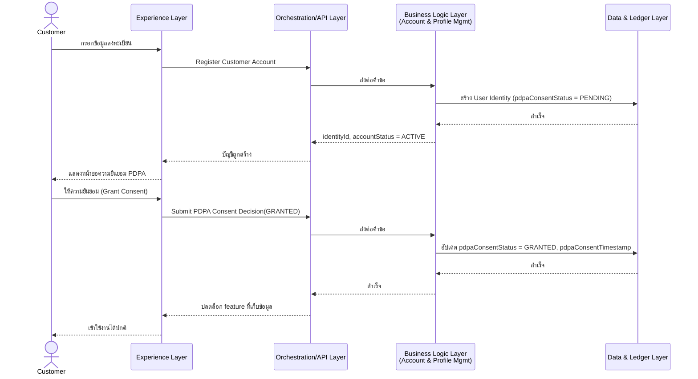

- **Alternate/Error Flows:** ดู Scenario 1.2 (ไม่ยินยอม/ถอนความยินยอม); `Validation Error` ถ้า email ซ้ำในระบบ (ปฏิเสธที่ Register Customer Account ก่อนสร้าง User Identity)
- **Postconditions:** User Identity ถูกสร้าง, `pdpaConsentStatus = GRANTED`, feature ที่เก็บข้อมูลทั้งหมดใช้งานได้
- **Business Rules Invoked:** ต้องมี `pdpaConsentStatus = GRANTED` ก่อนที่ feature อื่นที่เก็บ personal data จะทำงานได้ (CLAUDE.md หมวด 10; Database Schema §2.1 Business Rule Notes)
- **References:** FT-001, FT-016 — Customer Journey ขั้นตอน 1–2; Operation: Register Customer Account, Submit PDPA Consent Decision; Entity: User Identity

#### Scenario 1.2 — Consent Withheld or Withdrawn (Alternate)

- **Actors:** Customer
- **Preconditions:** มีบัญชีแล้ว (`pdpaConsentStatus` ไม่ใช่ `GRANTED`)
- **Trigger:** Customer Journey ขั้นตอน 2 "ไม่ยินยอม" หรือถอนความยินยอมภายหลัง — FT-016

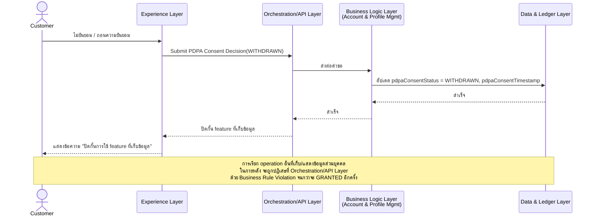

- **Alternate/Error Flows:** —
- **Postconditions:** `pdpaConsentStatus = PENDING/WITHDRAWN`; feature ที่เก็บข้อมูลถูกปิดกั้นทั้งหมด
- **Business Rules Invoked:** เดียวกับ Scenario 1.1 (บังคับใช้ทาง negative — ปิดกั้นแทนที่จะปลดล็อก)
- **References:** FT-016 — Customer Journey ขั้นตอน 2; Operation: Submit PDPA Consent Decision; Entity: User Identity

---

### Group 2 — Merchant Shop & QR Setup (FT-009, FT-002)

#### Scenario 2.1 — Generate QR Successfully (Main)

- **Actors:** Merchant
- **Preconditions:** Merchant Profile มีอยู่แล้วและ `status = ACTIVE` (ผ่าน Create/Update Merchant Shop Profile มาก่อน)
- **Trigger:** Merchant Journey ขั้นตอน 1–3 "Onboard / สร้าง QR" — FT-009, FT-002

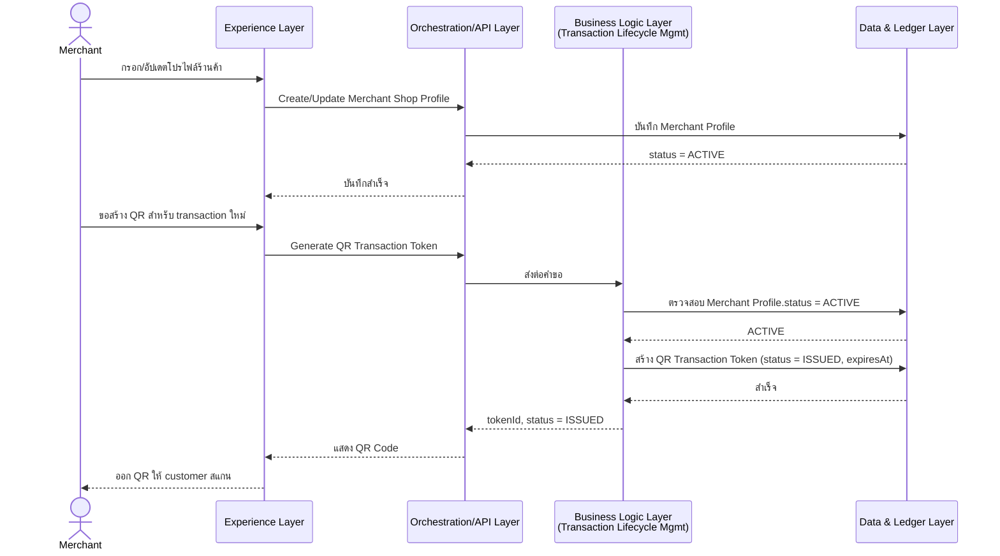

- **Alternate/Error Flows:** `Business Rule Violation` ถ้า Merchant Profile ไม่ `ACTIVE` — ปฏิเสธก่อนสร้าง token
- **Postconditions:** QR Transaction Token ถูกสร้าง สถานะ `ISSUED` มี `expiresAt`
- **Business Rules Invoked:** ต้องมี Merchant Profile `status = ACTIVE` ก่อนออก token เสมอ (Database Schema §2.2 Business Rule Notes); token ใช้ได้ครั้งเดียว มีเวลาจำกัด (FT-002)
- **References:** FT-009, FT-002 — Merchant Journey ขั้นตอน 1–3; Operation: Create/Update Merchant Shop Profile, Generate QR Transaction Token; Entity: Merchant Profile, QR Transaction Token

#### Scenario 2.2 — Cancel QR Before Scan (Alternate)

- **Actors:** Merchant
- **Preconditions:** มี QR Transaction Token สถานะ `ISSUED` ที่ยังไม่ถูกสแกน
- **Trigger:** Merchant ต้องการยกเลิกโค้ดด้วยมือ — FT-002

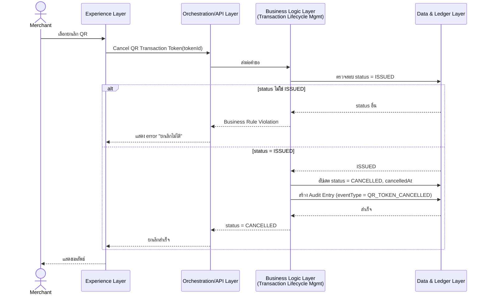

- **Alternate/Error Flows:** รวมอยู่ใน diagram ข้างต้น (`alt` block)
- **Postconditions:** token เปลี่ยนเป็น `CANCELLED` พร้อม `cancelledAt` (หรือคงเดิมถ้าปฏิเสธ); Audit Entry ถูกสร้างเมื่อยกเลิกสำเร็จ
- **Business Rules Invoked:** ยกเลิกได้เฉพาะขณะ `status = ISSUED` เท่านั้น (Database Schema §2.3)
- **References:** FT-002, FT-015 — Merchant Journey (extension); Operation: Cancel QR Transaction Token; Entity: QR Transaction Token, Audit Entry

---

### Group 3 — Transaction Creation via QR Scan (FT-003)

#### Scenario 3.1 — Valid Scan Creates Transaction (Main)

- **Actors:** Customer
- **Preconditions:** มี QR Transaction Token สถานะ `ISSUED` และยังไม่หมดอายุ
- **Trigger:** Customer Journey ขั้นตอน 4–6 "สแกน QR Code" — FT-003

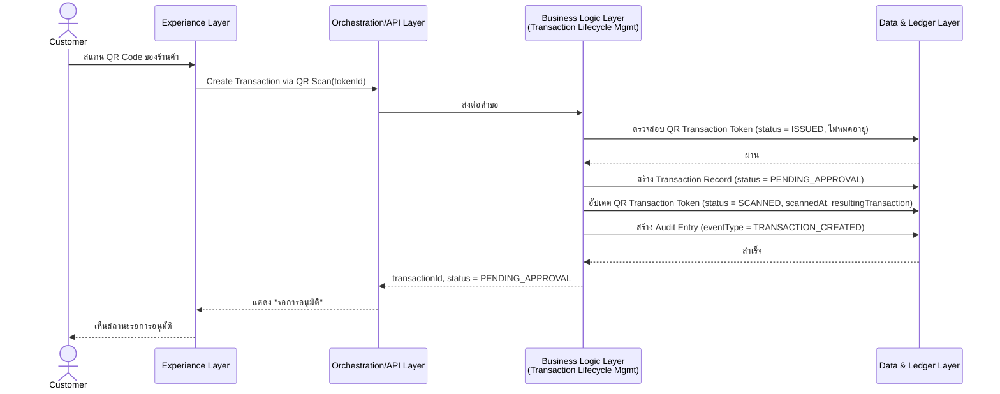

- **Alternate/Error Flows:** ดู Scenario 3.2
- **Postconditions:** Transaction Record ใหม่สถานะ `PENDING_APPROVAL`; QR Transaction Token เปลี่ยนเป็น `SCANNED`
- **Business Rules Invoked:** token ใช้ได้ครั้งเดียว (single-use) — เปลี่ยนเป็น `SCANNED` ทันทีที่สแกนสำเร็จ (Database Schema §2.3 Business Rule Notes)
- **References:** FT-003, FT-015 — Customer Journey ขั้นตอน 4–6, Merchant Journey ขั้นตอน 4–5; Operation: Create Transaction via QR Scan; Entity: QR Transaction Token, Transaction Record, Audit Entry

#### Scenario 3.2 — Invalid/Expired/Reused QR Rejected (Alternate)

- **Actors:** Customer
- **Preconditions:** QR Transaction Token หมดอายุ, ถูกใช้ไปแล้ว (`SCANNED`/`EXPIRED`/`CANCELLED`), หรือไม่มีอยู่จริง
- **Trigger:** Customer Journey ขั้นตอน 5 "ระบบตรวจสอบความถูกต้องของ QR" — FT-003

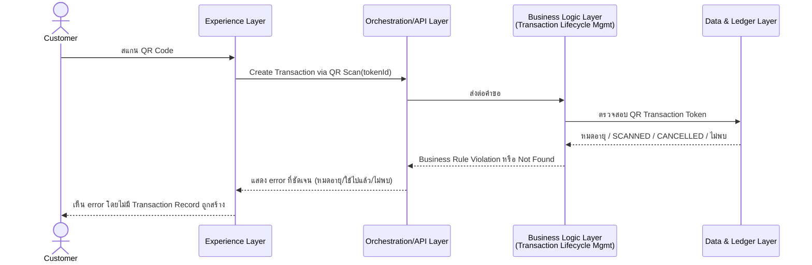

- **Alternate/Error Flows:** —
- **Postconditions:** ไม่มี Transaction Record ถูกสร้าง; token คงสถานะเดิม (ยกเว้นกรณีระบบตรวจพบว่าหมดอายุพอดีขณะสแกน — เปลี่ยนเป็น `EXPIRED`)
- **Business Rules Invoked:** ปฏิเสธการสแกนที่ไม่ถูกต้อง/หมดอายุ/ใช้ซ้ำเสมอ (FT-003)
- **References:** FT-003 — Customer Journey ขั้นตอน 5; Operation: Create Transaction via QR Scan; Entity: QR Transaction Token

---

### Group 4 — Merchant Approval & SP/Marketing Fee Distribution (FT-005, FT-006, FT-015)

#### Scenario 4.1 — Approve → Distribute SP (Main)

- **Actors:** Merchant, Platform (System)
- **Preconditions:** Transaction Record สถานะ `PENDING_APPROVAL`
- **Trigger:** Merchant Journey ขั้นตอน 6–7 "เปิด Pending Queue / อนุมัติ" — FT-005, FT-006

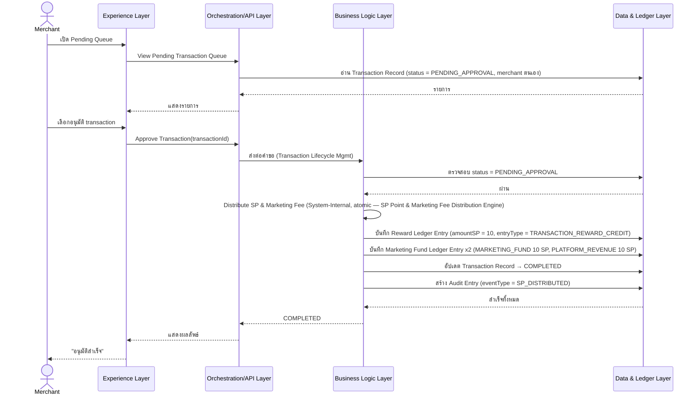

- **Alternate/Error Flows:** ดู Scenario 4.2 (Reject); `Business Rule Violation` ถ้า status ปัจจุบันไม่ใช่ `PENDING_APPROVAL` หรืออนุมัติซ้ำ (`Conflict/Idempotency Violation`)
- **Postconditions:** Transaction Record → `COMPLETED`; Reward Ledger Entry + Marketing Fund Ledger Entry ถูกสร้าง; Audit Entry ถูกสร้าง; Customer เห็นผลผ่าน Scenario 1.1/5.1 flow ที่เกี่ยวข้อง
- **Business Rules Invoked:** แบ่งสรรรวม 30 SP (10/10/10) แบบ atomic — ห้ามเชื่อค่าจาก client (CLAUDE.md หมวด 4, 6); ทุก state change ต้องสร้าง Audit Entry (FT-015, ดู Cross-Scenario Notes §4)
- **References:** FT-005, FT-006, FT-015 — Customer Journey ขั้นตอน 7–8, Merchant Journey ขั้นตอน 6–7; Operation: View Pending Transaction Queue, Approve Transaction, Distribute SP & Marketing Fee (System-Internal); Entity: Transaction Record, Reward Ledger Entry, Marketing Fund Ledger Entry, Audit Entry

#### Scenario 4.2 — Reject Transaction (Alternate)

- **Actors:** Merchant
- **Preconditions:** Transaction Record สถานะ `PENDING_APPROVAL`
- **Trigger:** Merchant Journey ขั้นตอน 7 "ปฏิเสธ" — FT-005

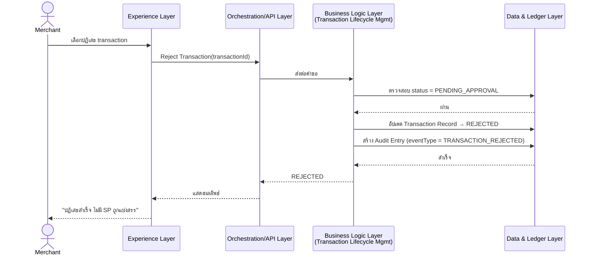

- **Alternate/Error Flows:** `Business Rule Violation` ถ้า status ปัจจุบันไม่ใช่ `PENDING_APPROVAL`
- **Postconditions:** Transaction Record → `REJECTED`; ไม่มี SP ถูกแบ่งสรร; Audit Entry ถูกสร้าง
- **Business Rules Invoked:** ไม่มี SP ถูกแบ่งสรรเมื่อปฏิเสธ; ต้องสร้าง Audit Entry เสมอ
- **References:** FT-005, FT-015 — Merchant Journey ขั้นตอน 7; Operation: Reject Transaction; Entity: Transaction Record, Audit Entry

---

### Group 5 — Customer Views SP Balance & Transaction History (FT-004)

#### Scenario 5.1 — View Balance & Transaction History (Main)

- **Actors:** Customer
- **Preconditions:** Customer มีบัญชีที่ผ่าน authentication แล้ว
- **Trigger:** Customer Journey ขั้นตอน 9 — FT-004

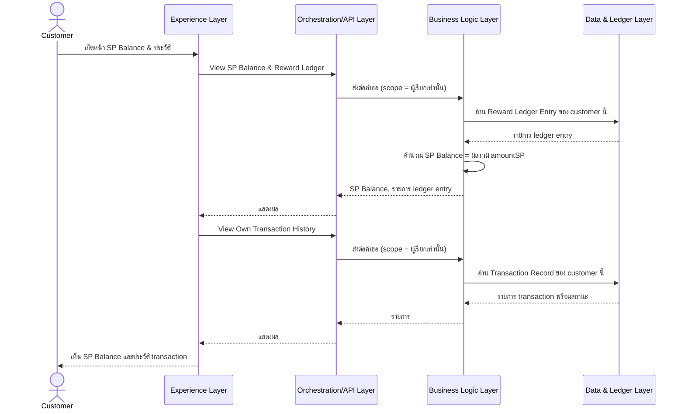

- **Alternate/Error Flows:** ไม่มี branch ที่มีความหมาย (เป็น read-only operation)
- **Postconditions:** ไม่มีการเปลี่ยนแปลงข้อมูล (read-only)
- **Business Rules Invoked:** SP Balance คำนวณจากผลรวม Reward Ledger Entry เสมอ ไม่ใช่ field แยก (Database Schema §2.5); จำกัด scope เฉพาะของผู้เรียก
- **References:** FT-004 — Customer Journey ขั้นตอน 9; Operation: View SP Balance & Reward Ledger, View Own Transaction History; Entity: Reward Ledger Entry, Transaction Record

---

### Group 6 — Reward Redemption & Fulfillment (FT-007, FT-008)

#### Scenario 6.1 — Successful Redemption & Fulfillment (Main)

- **Actors:** Customer, Merchant
- **Preconditions:** Customer มี SP Balance เพียงพอ
- **Trigger:** Customer Journey ขั้นตอน 10–11, Merchant Journey ขั้นตอน 9–10 — FT-007, FT-008

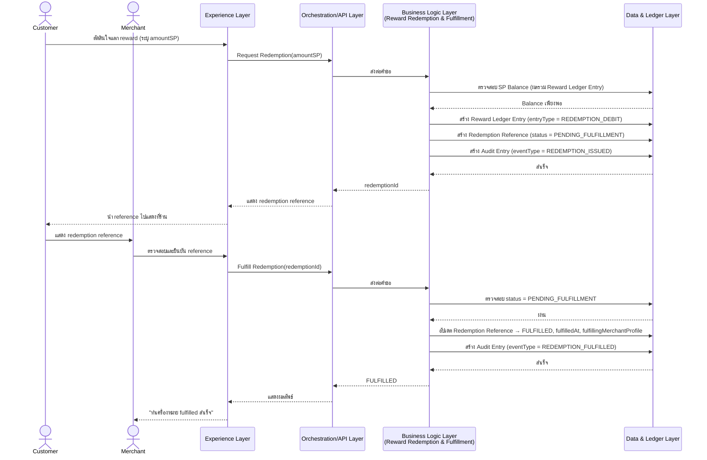

- **Alternate/Error Flows:** ดู Scenario 6.2 (SP ไม่พอ) และ 6.3 (fulfill ซ้ำ)
- **Postconditions:** Reward Ledger Entry (debit) + Redemption Reference (`PENDING_FULFILLMENT` → `FULFILLED`) + Audit Entry ถูกสร้างทั้งตอนขอแลก (`REDEMPTION_ISSUED`) และตอน fulfill (`REDEMPTION_FULFILLED`)
- **Business Rules Invoked:** ต้องตรวจสอบ SP balance เพียงพอก่อนสร้าง Redemption Reference เสมอ (Database Schema §2.7); ใช้ redemption reference ได้ครั้งเดียว
- **References:** FT-007, FT-008, FT-015 — Customer Journey ขั้นตอน 10–11, Merchant Journey ขั้นตอน 9–10; Operation: Request Redemption, Fulfill Redemption; Entity: Reward Ledger Entry, Redemption Reference, Audit Entry

#### Scenario 6.2 — Insufficient SP Balance (Alternate)

- **Actors:** Customer
- **Preconditions:** SP Balance ของ Customer น้อยกว่า amountSP ที่ขอแลก
- **Trigger:** Customer Journey ขั้นตอน 10 "SP balance เพียงพอ?" — FT-007

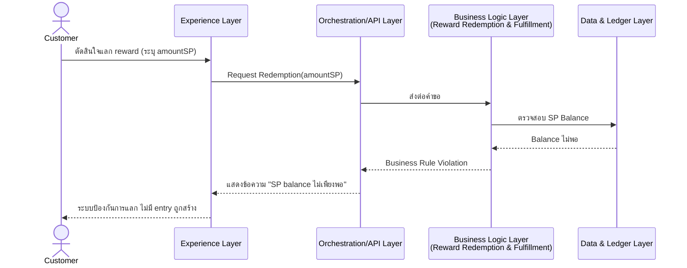

- **Alternate/Error Flows:** —
- **Postconditions:** ไม่มี Reward Ledger Entry/Redemption Reference ถูกสร้าง
- **Business Rules Invoked:** ตรวจสอบ balance ก่อนเสมอ (เหมือน Scenario 6.1)
- **References:** FT-007 — Customer Journey ขั้นตอน 10; Operation: Request Redemption; Entity: Reward Ledger Entry

#### Scenario 6.3 — Fulfill Already-Fulfilled Redemption (Idempotency, Alternate)

- **Actors:** Merchant
- **Preconditions:** Redemption Reference มีสถานะ `FULFILLED` อยู่แล้ว
- **Trigger:** Merchant ตรวจสอบ reference ที่ถูกใช้ไปแล้วซ้ำ — FT-008

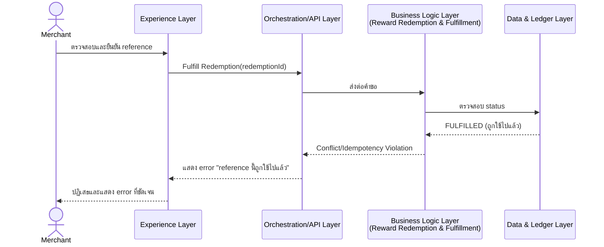

- **Alternate/Error Flows:** —
- **Postconditions:** ไม่มีการเปลี่ยนแปลง — ป้องกันการ fulfill ซ้ำ
- **Business Rules Invoked:** ป้องกันการใช้ redemption reference ซ้ำ (FT-008, Database Schema §2.7)
- **References:** FT-008 — Merchant Journey ขั้นตอน 9; Operation: Fulfill Redemption; Entity: Redemption Reference

---

### Group 7 — Merchant Fee & Transaction Reconciliation (FT-010)

#### Scenario 7.1 — View Reconciliation (Main)

- **Actors:** Merchant
- **Preconditions:** Merchant มี transaction ที่ `COMPLETED` อย่างน้อย 1 รายการ (ถ้าไม่มี จะเห็นรายการว่าง)
- **Trigger:** Merchant Journey ขั้นตอน 8 — FT-010

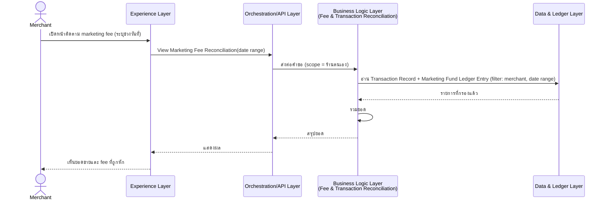

- **Alternate/Error Flows:** `Validation Error` ถ้าช่วงวันที่ไม่ถูกต้อง
- **Postconditions:** ไม่มีการเปลี่ยนแปลงข้อมูล (read-only)
- **Business Rules Invoked:** จำกัด scope เฉพาะร้านของผู้เรียก
- **References:** FT-010 — Merchant Journey ขั้นตอน 8; Operation: View Marketing Fee Reconciliation; Entity: Transaction Record, Marketing Fund Ledger Entry

---

### Group 8 — Admin Account & Platform Operations (FT-011, FT-012, FT-013, FT-014)

#### Scenario 8.1 — Manage Account Status (Main)

- **Actors:** Admin
- **Preconditions:** target User Identity หรือ Merchant Profile มีอยู่จริง
- **Trigger:** Admin Journey ขั้นตอน 1 — FT-011

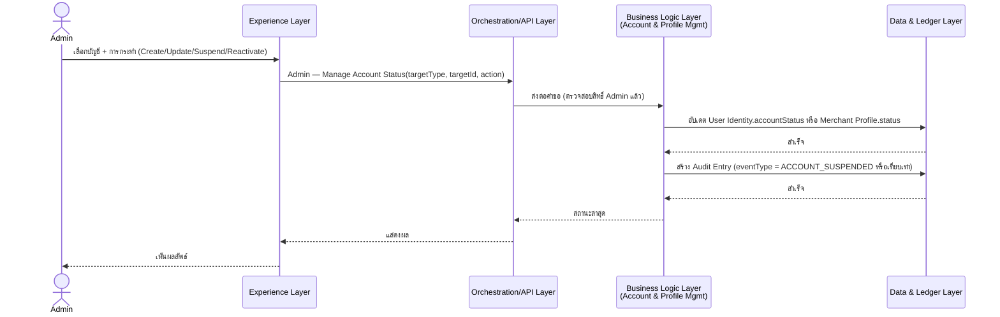

- **Alternate/Error Flows:** `Not Found` (targetId ไม่มีอยู่จริง), `Validation Error`
- **Postconditions:** `accountStatus`/`status` ของ target เปลี่ยนแปลง; Audit Entry ถูกสร้าง
- **Business Rules Invoked:** การเปลี่ยนสถานะบัญชีทุกครั้งต้องสร้าง Audit Entry (FT-015)
- **References:** FT-011, FT-015 — Admin Journey ขั้นตอน 1; Operation: Admin — Manage Account Status; Entity: User Identity, Merchant Profile, Audit Entry

#### Scenario 8.2 — View Reward Rule Configuration (Main)

- **Actors:** Admin
- **Preconditions:** ไม่มี
- **Trigger:** Admin Journey ขั้นตอน 2 — FT-012

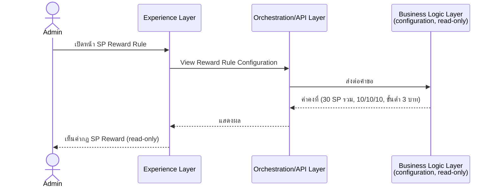

- **Alternate/Error Flows:** —
- **Postconditions:** ไม่มีการเปลี่ยนแปลงข้อมูล (read-only, ไม่มี entity เกี่ยวข้อง)
- **Business Rules Invoked:** read-only ใน MVP เท่านั้น (FT-012) — ไม่มีเส้นทางแก้ไขค่านี้ผ่าน operation ใด
- **References:** FT-012 — Admin Journey ขั้นตอน 2; Operation: View Reward Rule Configuration; Entity: *(ไม่มี)*

#### Scenario 8.3 — System Monitoring Dashboard (Main)

- **Actors:** Admin
- **Preconditions:** ไม่มี
- **Trigger:** Admin Journey ขั้นตอน 3 — FT-013

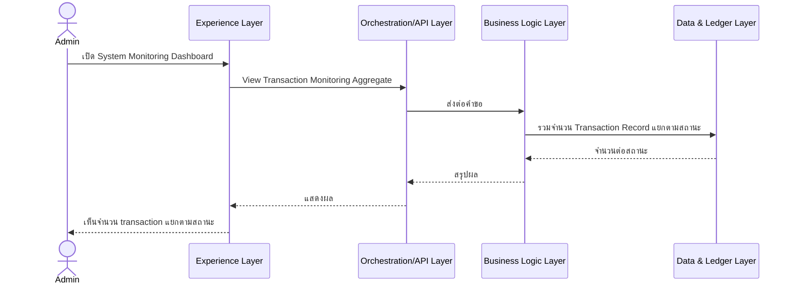

- **Alternate/Error Flows:** —
- **Postconditions:** ไม่มีการเปลี่ยนแปลงข้อมูล (read-only aggregate)
- **Business Rules Invoked:** ไม่มีการเปิดเผย record รายบุคคล คืนค่าเป็นตัวเลขสรุปเท่านั้น
- **References:** FT-013 — Admin Journey ขั้นตอน 3; Operation: View Transaction Monitoring Aggregate; Entity: Transaction Record

#### Scenario 8.4 — Manual Transaction Cancellation (Main)

- **Actors:** Admin
- **Preconditions:** Transaction Record สถานะ `PENDING_APPROVAL` ค้างอยู่นาน
- **Trigger:** Admin Journey ขั้นตอน 4–5 — FT-014

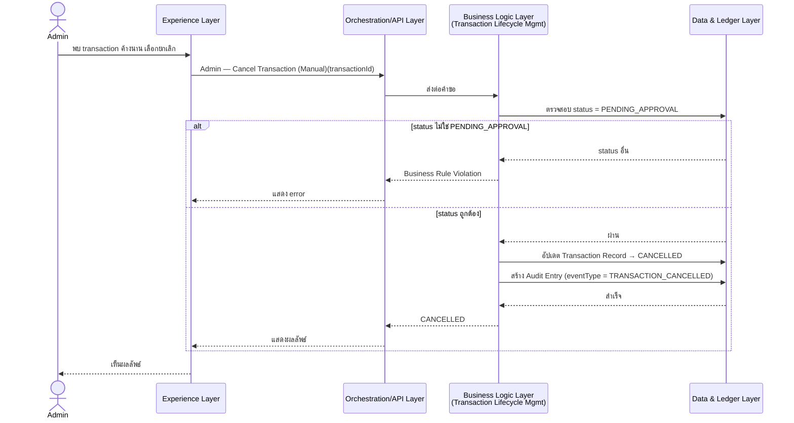

- **Alternate/Error Flows:** รวมอยู่ใน diagram (`alt` block)
- **Postconditions:** Transaction Record → `CANCELLED`; ไม่มี SP ถูกแบ่งสรร; Audit Entry ถูกสร้าง
- **Business Rules Invoked:** ยกเลิกได้เฉพาะขณะ `PENDING_APPROVAL`; เป็นมาตรการชั่วคราวก่อนมี SLA อัตโนมัติ (FT-019 ยัง Blocked — ดู Open Questions)
- **References:** FT-014, FT-015 — Admin Journey ขั้นตอน 4–5; Operation: Admin — Cancel Transaction (Manual); Entity: Transaction Record, Audit Entry

---

### Group 9 — Immutable Audit Trail & Investigation (FT-015)

#### Scenario 9.1 — Search Audit Log (Main)

- **Actors:** Admin
- **Preconditions:** มี Audit Entry อยู่ในระบบ (ถูกสร้างจาก scenario อื่นที่เปลี่ยนแปลง state)
- **Trigger:** Admin Journey ขั้นตอน 6–7 — FT-015

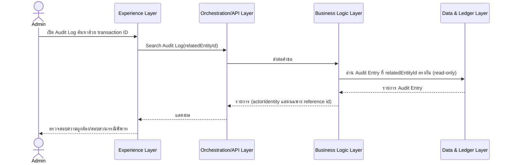

- **Alternate/Error Flows:** `Not Found` (ไม่พบ Audit Entry ที่ตรงกัน)
- **Postconditions:** ไม่มีการเปลี่ยนแปลงข้อมูล — **ไม่มีเส้นทางแก้ไข/ลบ Audit Entry แม้แต่ Admin** (immutable, Database Schema §2.8)
- **Business Rules Invoked:** read-only เท่านั้น; data minimization บน `actorIdentity` (Personal Data)
- **References:** FT-015 — Admin Journey ขั้นตอน 6–7; Operation: Search Audit Log; Entity: Audit Entry

---

### Group 10 — Data Minimization & Secure Access (FT-017)

#### Scenario 10.1 — View/Update Own Profile (Main)

- **Actors:** Customer, Merchant Staff, Admin
- **Preconditions:** ผู้เรียกผ่าน Authenticate แล้ว (ดู Cross-Scenario Notes §4.1)
- **Trigger:** cross-cutting — ทุก actor ดู/แก้ไขข้อมูลของตนเอง — FT-017

```mermaid
sequenceDiagram
    actor Actor as Customer/Merchant Staff/Admin
    participant EXP as Experience Layer
    participant API as Orchestration/API Layer
    participant BL as Business Logic Layer<br/>(Account & Profile Mgmt)
    participant DATA as Data & Ledger Layer

    Actor->>EXP: เปิดหน้าโปรไฟล์ตนเอง
    EXP->>API: View/Update Own Profile
    API->>BL: ส่งต่อคำขอ (scope = identity ของผู้เรียกเท่านั้น)
    BL->>DATA: อ่าน/อัปเดต User Identity (เฉพาะ field ที่อนุญาต)
    DATA-->>BL: สำเร็จ
    BL-->>API: field ของตนเองเท่านั้น
    API-->>EXP: แสดงผล
    EXP-->>Actor: เห็น/แก้ไขข้อมูลของตนเอง
```

- **Alternate/Error Flows:** `Authorization Error` ถ้าพยายามเข้าถึง/แก้ไข identity อื่น
- **Postconditions:** ไม่มีการเปลี่ยนแปลงข้อมูลของ identity อื่นใด ๆ
- **Business Rules Invoked:** เปิดเผย/แก้ไขเฉพาะ field ที่จำเป็น (data minimization, FT-017, Database Schema §6 Access Control Matrix)
- **References:** FT-017 — cross-cutting; Operation: View/Update Own Profile; Entity: User Identity

---

## 4. Cross-Scenario Notes (บันทึกที่ใช้ร่วมกันหลาย Scenario)

### 4.1 Authentication Check

ทุก scenario ยกเว้น **Scenario 1.1 (Register Customer Account ส่วนแรก)**
ต้องผ่าน **Authenticate (Login)** ที่ Orchestration/API Layer ก่อนเสมอ
(ตรวจสอบ `accountStatus = ACTIVE`) — ไม่แสดงซ้ำเต็มรูปแบบในทุก diagram
ข้างต้น แต่ถือว่าเป็นขั้นตอนที่เกิดขึ้นก่อน message แรกที่ actor ส่งไปยัง
Orchestration/API Layer เสมอ (Architecture §3.6 Cross-Cutting: Security,
Audit & Compliance)

### 4.2 Audit Entry Creation

ทุก scenario ที่เปลี่ยนแปลง state ของ Transaction Record, QR
Transaction Token (cancel), Redemption Reference, หรือ User
Identity/Merchant Profile (status) ต้องสร้าง **Audit Entry** แบบ
immutable เสมอ (FT-015) — แสดงไว้ชัดเจนใน sequence diagram ของแต่ละ
scenario ที่เกี่ยวข้องแล้ว (Scenario 4.1, 4.2, 6.1, 8.1, 8.4)

### 4.3 PDPA Consent Gate

Operation ที่เก็บ/แสดง personal data เพิ่มเติม (นอกเหนือ Register/
Authenticate) ต้องผ่านการตรวจสอบ `pdpaConsentStatus = GRANTED` ที่
Orchestration/API Layer ก่อนเสมอ ตาม Scenario 1.2 — ไม่แสดงซ้ำเต็ม
รูปแบบในทุก diagram แต่ถือเป็นเงื่อนไขที่บังคับใช้ร่วมกัน

---

## 5. Current Technical Direction (Non-Binding Reference) — ทิศทางเทคนิคปัจจุบัน (ไม่ผูกมัด)

> ส่วนนี้สะท้อนทิศทางเทคนิคปัจจุบันตาม CLAUDE.md หมวด 6 เท่านั้น ไม่ใช่
> constraint ของ sequence ระดับแนวคิดข้างต้น และเปลี่ยนแปลงได้โดยไม่
> กระทบลำดับขั้นตอนที่อธิบายไว้

`02-design/01-transaction-flow.md` (เอกสารเดิม, pre-agent) อธิบาย
transaction lifecycle แบบผูกกับ Firebase Authentication/Cloud
Functions/Firestore อยู่แล้ว — เอกสารนั้น**เป็นเอกสารแยกอิสระ** ไม่ได้ถูก
แก้ไขโดย agent นี้ Scenario ในเอกสารนี้ที่เกี่ยวข้องกับวงจรชีวิตของ
Transaction Record (Group 3, 4) สอดคล้องเชิงแนวคิดกับส่วน "Transaction
Lifecycle" ของเอกสารนั้น ยกเว้นสถานะ `PROCESSING`/`FAILED` ที่มีเฉพาะใน
`01-transaction-flow.md` และไม่มีใน Database Schema/Architecture ปัจจุบัน
(ดู Database Schema §9 ข้อ 2 — เป็นความไม่สอดคล้องที่มีอยู่ก่อนรอบนี้
ยังไม่ถูก reconcile)

ตามทิศทางปัจจุบัน (Firebase Cloud Functions) แต่ละ message ระหว่าง
Orchestration/API Layer ↔ Business Logic Layer ในทุก sequence diagram
ข้างต้นสอดคล้องกับการเรียก Cloud Function 1 ครั้งต่อ 1 Operation — ยังไม่
มีการระบุ trigger type/protocol ที่ชัดเจน (ดู `02-design/06-api-spec.md`
§7)

---

## 6. Open Questions / Assumptions (ประเด็นที่ยังไม่ชัดเจน)

1. **Transaction status enum ไม่ตรงกันข้ามเอกสาร (สืบทอดจาก Database
   Schema §9 ข้อ 2)** — Scenario ใน Group 3–4 ใช้ชุดสถานะจาก Architecture/
   Database Schema (`PENDING_APPROVAL`/`APPROVED`/`REJECTED`/`CANCELLED`/
   `COMPLETED`) ซึ่งต่างจาก `01-transaction-flow.md` เดิม — ยังไม่ถูก
   reconcile จากรอบก่อนหน้า ไม่ใช่ปัญหาใหม่ของเอกสารนี้
2. **Notification ระหว่างรออนุมัติ** (Architecture §9, BRD Open Question
   7) — ถ้ามีคำตอบว่าต้องมี notification จริง Scenario 4.1/4.2 อาจต้อง
   เพิ่มขั้นตอน "แจ้งเตือน Customer" ระหว่างรอผล
3. **FT-019 SLA/Auto-Cancel ยัง Blocked** — Scenario 8.4 (Manual
   Cancellation) เป็นเพียงเส้นทางชั่วคราว เมื่อ FT-019 ได้คำตอบแล้วต้อง
   เพิ่ม Scenario ใหม่สำหรับ auto-cancel
4. **View Transaction Monitoring Aggregate (Scenario 8.3) ยังไม่มี filter
   ช่วงเวลาที่ชัดเจน** (สืบทอดจาก API Spec §8 ข้อ 2) — ยังไม่กระทบ
   sequence diagram ระดับแนวคิดในรอบนี้

---

*เอกสารนี้ควรได้รับการ review ร่วมกับ business stakeholder และปรับปรุง
เมื่อ Feature List, User Journey, Architecture, Database Schema, หรือ API
Spec มี revision ใหม่*
